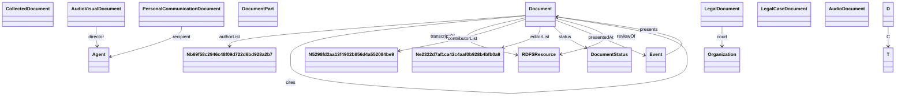

```mermaid
	classDiagram

    
    class CollectedDocument {
    
    }

    class AudioVisualDocument {
    
    }

    class PersonalCommunicationDocument {
    
    }

    class DocumentPart {
    
    }

    class Document {
    
    }

    class LegalDocument {
    
    }

    class LegalCaseDocument {
    
    }

    class AudioDocument {
    
    }

    class DocumentStatus {
    
    }


Document  --> Nb69f58c2946c48f09d722d6bd928a2b7   :authorList  

AudioVisualDocument  --> Agent   :director  

Event  --> Document   :presents  

Document  --> Document   :translationOf  

Document  --> Document   :citedBy  

Document  --> RDFSResource   :transcriptOf  

Document  --> N5298fd2aa13f4902b856d4a552084be9   :contributorList  

Document  --> Document   :reproducedIn  

LegalDocument  --> Organization   :court  

D  --> T   :C  

PersonalCommunicationDocument  --> Agent   :recipient  

Document  --> Document   :cites  

Document  --> Ne2322d7af1ca42c4aaf0b928b4bfb0a9   :editorList  

Document  --> DocumentStatus   :status  

Document  --> Event   :presentedAt  

Document  --> RDFSResource   :reviewOf  

```