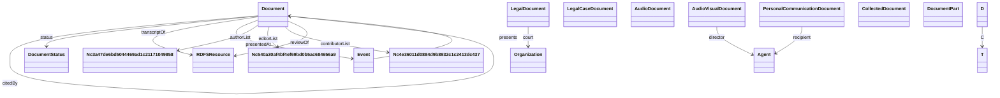

```mermaid
	classDiagram

    
    class LegalDocument {
    
    }

    class Document {
    
    }

    class LegalCaseDocument {
    
    }

    class AudioDocument {
    
    }

    class AudioVisualDocument {
    
    }

    class PersonalCommunicationDocument {
    
    }

    class DocumentStatus {
    
    }

    class CollectedDocument {
    
    }

    class DocumentPart {
    
    }


Document  --> Document   :translationOf  

Event  --> Document   :presents  

Document  --> Document   :cites  

Document  --> DocumentStatus   :status  

Document  --> RDFSResource   :transcriptOf  

Document  --> Event   :presentedAt  

Document  --> Nc3a47de6bd5044469ad1c21171049858   :authorList  

LegalDocument  --> Organization   :court  

Document  --> Nc540a30af4bf4ef69bd0b5ac684656a9   :editorList  

AudioVisualDocument  --> Agent   :director  

Document  --> Document   :reproducedIn  

Document  --> Nc4e36011d0884d9b8932c1c2413dc437   :contributorList  

PersonalCommunicationDocument  --> Agent   :recipient  

D  --> T   :C  

Document  --> Document   :citedBy  

Document  --> RDFSResource   :reviewOf  

```