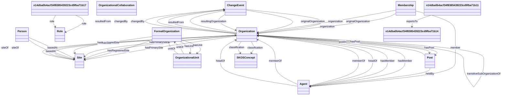

```mermaid
	classDiagram

    
    class ChangeEvent {
    
    }

    class FormalOrganization {
    
    }

    class Role {
    
    }

    class Site {
    
    }

    class OrganizationalCollaboration {
    
    }

    class Organization {
    
    }

    class OrganizationalUnit {
    
    }


Organization  --> ChangeEvent   :resultedFrom  

Organization  --> Post   :hasPost  

Membership  --> Organization   :organization  

Organization  --> Site   :hasPrimarySite  

n14dba0b4acf34f8385439223cd9fba71b17  --> Role   :role  

FormalOrganization  --> Site   :hasRegisteredSite  

Organization  --> Organization   :transitiveSubOrganizationOf  

Agent  --> Organization   :headOf  

n14dba0b4acf34f8385439223cd9fba71b17  --> Role   :role  

Membership  --> Agent   :member  

Organization  --> Site   :hasSite  

Site  --> Organization   :siteOf  

Organization  --> Organization   :subOrganizationOf  

Organization  --> Organization   :linkedTo  

Organization  --> ChangeEvent   :changedBy  

Site  --> Organization   :siteOf  

Organization  --> Post   :hasPost  

OrganizationalUnit  --> FormalOrganization   :unitOf  

Organization  --> Organization   :linkedTo  

Organization  --> ChangeEvent   :changedBy  

Post  --> Agent   :heldBy  

Organization  --> Agent   :hasMember  

Agent  --> Organization   :memberOf  

FormalOrganization  --> OrganizationalUnit   :hasUnit  

Organization  --> Organization   :subOrganizationOf  

Organization  --> Agent   :hasMember  

Organization  --> Site   :hasPrimarySite  

FormalOrganization  --> Site   :hasRegisteredSite  

FormalOrganization  --> OrganizationalUnit   :hasUnit  

Person  --> Site   :basedAt  

Organization  --> Organization   :hasSubOrganization  

Organization  --> ChangeEvent   :resultedFrom  

Person  --> Site   :basedAt  

Organization  --> SKOSConcept   :classification  

Organization  --> Organization   :hasSubOrganization  

OrganizationalUnit  --> FormalOrganization   :unitOf  

Organization  --> Organization   :transitiveSubOrganizationOf  

Agent  --> Organization   :memberOf  

ChangeEvent  --> Organization   :originalOrganization  

Membership  --> Organization   :organization  

ChangeEvent  --> Organization   :originalOrganization  

n14dba0b4acf34f8385439223cd9fba71b11  --> n14dba0b4acf34f8385439223cd9fba71b14   :reportsTo  

Organization  --> Site   :hasSite  

Post  --> Organization   :postIn  

Organization  --> SKOSConcept   :classification  

Agent  --> Organization   :headOf  

ChangeEvent  --> Organization   :resultingOrganization  

```