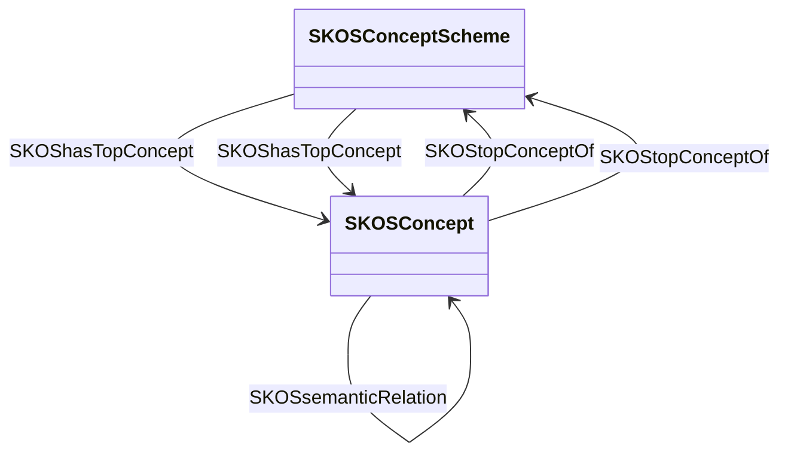

```mermaid
	classDiagram

    
    class SKOSConceptScheme {
    
    }

    class SKOSConcept {
    
    }


SKOSConceptScheme  --> SKOSConcept   :SKOShasTopConcept  

SKOSConcept  --> SKOSConceptScheme   :SKOStopConceptOf  

SKOSConcept  --> SKOSConceptScheme   :SKOStopConceptOf  

SKOSConceptScheme  --> SKOSConcept   :SKOShasTopConcept  

SKOSConcept  --> SKOSConcept   :SKOSsemanticRelation  

```