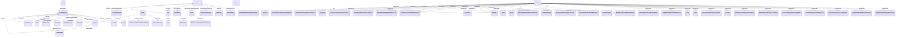

```mermaid
	classDiagram

    
    class OrganisedEvent {
    
    }

    class AcademicEvent {
    
    }

    class Agent {
    
    }

    class Collection {
    
    }

    class Track {
    
    }

    class Author {
    
    }

    class Sponsor {
    
    }

    class AgentClass {
    
    }

    class Publication {
    
    }

    class Person {
    
    }


OrganisedEvent  --> Keynote   :hasKeynote  

Publication  --> N8309d8227469475a8cf2b813f222299b   :hasAppendix  

Agent  --> OrganisedEvent   :participatesIn  

Publication  --> Nab0463535dbf46b89f0b7661908d125f   :hasAppendix  

Publication  --> N5b0974cc6bc04c33923c70ebe8339c0d   :hasAppendix  

Sponsor  --> OrganisedEvent   :isSponsorOf  

AcademicEvent  --> ImportantDates   :hasImportantDates  

AcademicEvent  --> AgentClass   :audience  

Publication  --> N27435501491446f391b982fdaf57707f   :hasAppendix  

Publication  --> N3751dca2f6094ce0aa73653389eaf395   :hasAppendix  

OrganisedEvent  --> City   :heldInCity  

Publication  --> N26816335847e48bf9d5c6473539f2340   :hasAppendix  

Publication  --> N74bd46d03e4841988062884244ab845c   :hasAppendix  

Publication  --> Container   :hasAppendix  

Publication  --> Ndcfded3da1bd45e3934e0478802f2f1e   :hasAppendix  

Publication  --> Bucket   :hasAppendix  

AcademicEvent  --> SubmissionGuidelines   :hasSubmissionGuidelines  

AcademicEvent  --> Person   :hasProgramCommitteeMember  

Author  --> AuthorRegistration   :registeredAs  

Person  --> N9038177a73004a1a851817639f3f53a3   :participatesAs  

Publication  --> Error2   :hasAppendix  

Publication  --> Ncb99ab426a034c039fe3456a5ade17be   :hasAppendix  

Publication  --> N8bd404b261074afc9309c60dcfe9abfe   :hasAppendix  

Track  --> AcademicEvent   :isTrackOf  

AcademicEvent  --> SocialEvent   :hasSocialEvent  

Publication  --> Proceedings   :belongsToProceedings  

Publication  --> N8f58ed1c3f4747b49998b4b4a818af05   :hasAppendix  

OrganisedEvent  --> Sponsor   :hasSponsor  

Person  --> Organization   :hasAffiliation  

Publication  --> HeadedContainer   :hasAppendix  

Publication  --> N3b16c35af26144f0a90c63ddf75dca77   :hasAppendix  

Publication  --> Nc49ce40a1f984657aac1a2bc50c0e455   :hasAppendix  

Publication  --> DiscourseElement   :hasAppendix  

Track  --> Chair   :hasChair  

Publication  --> N1974c387bad443b197ad7c630036379b   :hasAppendix  

Publication  --> Section   :hasAppendix  

OrganisedEvent  --> Country   :heldInCountry  

Publication  --> Pattern   :hasAppendix  

Author  --> N87cb97cf75dd4a67be8d8ef03628af53   :hasRegistrationType  

Publication  --> Appendix   :hasAppendix  

OrganisedEvent  --> OrganisedEvent   :colocatedWith  

EventSeries  --> OrganisedEvent   :hasEvent  

OrganisedEvent  --> TravelInformation   :providesTravelInformation  

AcademicEvent  --> Track   :hasTrack  

Sponsor  --> Sponsorship   :sponsorshipType  

Publication  --> N71e48c011fc54105a886656e9399e75d   :hasAppendix  

OrganisedEvent  --> EventSeries   :belongsToSeries  

OrganisedEvent  --> Award   :offersAward  

OrganisedEvent  --> Registration   :hasRegistration  

Publication  --> N295e600cda314add8cc63e53b4779782   :hasAppendix  

Publication  --> N0a01d912fa46494c962842f7889f5b06   :hasAppendix  

Publication  --> N7a52e16e1c4b4857a4446a3d214200cc   :hasAppendix  

Author  --> Award   :takesAward  

Publication  --> NonTextual   :hasAppendix  

AcademicEvent  --> BestPaperAward   :offersBestPaperAward  

Publication  --> Nc096bd19df574ca1bdad83b4891537dc   :hasAppendix  

Publication  --> Nc1c508730e9748b7824f3ef6976014ad   :hasAppendix  

Publication  --> Structured   :hasAppendix  

Publication  --> Ncfb358be908e4095aeadbe3744120fa7   :hasAppendix  

Keynote  --> OrganisedEvent   :keynoteIn  

OrganisedEvent  --> Flyer   :hasFlyer  

Proceedings  --> Publication   :cite  

```