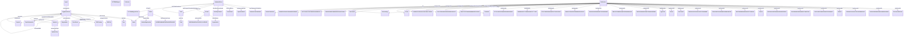

```mermaid
	classDiagram

    
    class OrganisedEvent {
    
    }

    class AcademicEvent {
    
    }

    class DCTERMSAgent {
    
    }

    class Collection {
    
    }

    class Track {
    
    }

    class Author {
    
    }

    class Sponsor {
    
    }

    class DCTERMSAgentClass {
    
    }

    class Publication {
    
    }

    class Person {
    
    }


Publication  --> DiscourseElement   :hasAppendix  

Publication  --> N21defa915998452b82ca0882640df94d   :hasAppendix  

Publication  --> N399ab5e2ed3a4c21bfc56423d8e0fe6f   :hasAppendix  

Publication  --> Pattern   :hasAppendix  

Agent  --> OrganisedEvent   :participatesIn  

Publication  --> Ne2f3c40103f944159b044740096da607   :hasAppendix  

OrganisedEvent  --> Award   :offersAward  

AcademicEvent  --> SubmissionGuidelines   :hasSubmissionGuidelines  

Publication  --> N1e130d91b0df459a8fa54f74aa5514f6   :hasAppendix  

Publication  --> Nb0ba8ecbdf264941ba4fde58606992ee   :hasAppendix  

Publication  --> Section   :hasAppendix  

Publication  --> N6a758256945e4922a323f7f72ff94dca   :hasAppendix  

OrganisedEvent  --> Flyer   :hasFlyer  

Publication  --> N0bd6e260218d43f888a7a384dc6b348f   :hasAppendix  

Publication  --> N868a92cd55454d91a3650132fe449bd7   :hasAppendix  

OrganisedEvent  --> EventSeries   :belongsToSeries  

Publication  --> NonTextual   :hasAppendix  

Publication  --> Bucket   :hasAppendix  

Publication  --> Appendix   :hasAppendix  

Author  --> Nc28f812c8de64b7b990de2d020bd9c38   :hasRegistrationType  

Author  --> AuthorRegistration   :registeredAs  

Publication  --> Ndf015e944a1d4436a2745aa4c40656ba   :hasAppendix  

OrganisedEvent  --> Sponsor   :hasSponsor  

OrganisedEvent  --> DBOCity   :heldInCity  

AcademicEvent  --> ImportantDates   :hasImportantDates  

AcademicEvent  --> SocialEvent   :hasSocialEvent  

Publication  --> N8ec33574d88043a3b3a5093e466eeecb   :hasAppendix  

Publication  --> Nfcbfbe0a4f954d93986721066d23ab85   :hasAppendix  

Publication  --> Na9bfc7181a454e558d99dbf45e666ed1   :hasAppendix  

Sponsor  --> OrganisedEvent   :isSponsorOf  

Author  --> Award   :takesAward  

Sponsor  --> Sponsorship   :sponsorshipType  

OrganisedEvent  --> DBOCountry   :heldInCountry  

Publication  --> N73e718863fd24a5d878c075a43c63b35   :hasAppendix  

Publication  --> Neb898e099717429593c639274777c300   :hasAppendix  

Person  --> Organization   :hasAffiliation  

Publication  --> N172dcc83c5f5462d95816e5b54f83b03   :hasAppendix  

AcademicEvent  --> BestPaperAward   :offersBestPaperAward  

OrganisedEvent  --> Registration   :hasRegistration  

OrganisedEvent  --> OrganisedEvent   :colocatedWith  

AcademicEvent  --> Track   :hasTrack  

Keynote  --> OrganisedEvent   :keynoteIn  

Publication  --> Proceedings   :belongsToProceedings  

Publication  --> Container   :hasAppendix  

Publication  --> N06107f2973da4b4bb6b9af092d10d14c   :hasAppendix  

Publication  --> N1ee765fea08445a2814fb48bc0c06a70   :hasAppendix  

Publication  --> N2693a21c940b4aaca5db39abc7d43bf2   :hasAppendix  

Publication  --> Error2   :hasAppendix  

OrganisedEvent  --> Keynote   :hasKeynote  

Publication  --> Structured   :hasAppendix  

Publication  --> Ne9c91e3b387a4dbd8d2500fa4e97ba0d   :hasAppendix  

Publication  --> N627e0ba8e76b4f7089f4cb8a486006dc   :hasAppendix  

Publication  --> N0fd4f32fc28c41e78e2426f1fa019ea3   :hasAppendix  

EventSeries  --> OrganisedEvent   :hasEvent  

OrganisedEvent  --> TravelInformation   :providesTravelInformation  

Publication  --> HeadedContainer   :hasAppendix  

AcademicEvent  --> Person   :hasProgramCommitteeMember  

AcademicEvent  --> DCTERMSAgentClass   :DCTERMSaudience  

Track  --> AcademicEvent   :isTrackOf  

Person  --> Nf44f30a4d4f14ed7a6941e7ec105c921   :participatesAs  

Track  --> Chair   :hasChair  

Proceedings  --> Publication   :cite  

```