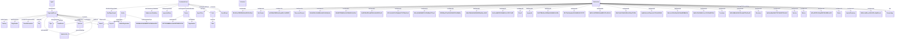

```mermaid
	classDiagram

    
    class OrganisedEvent {
    
    }

    class AcademicEvent {
    
    }

    class Agent {
    
    }

    class Collection {
    
    }

    class Track {
    
    }

    class Author {
    
    }

    class Sponsor {
    
    }

    class AgentClass {
    
    }

    class Publication {
    
    }

    class Person {
    
    }


Publication  --> N2c5fa3ad78ff483fa29edf9951b3f4ed   :hasAppendix  

OrganisedEvent  --> Country   :heldInCountry  

Sponsor  --> Sponsorship   :sponsorshipType  

Person  --> N0731304d888c4cd4a1197f5003167284   :participatesAs  

Publication  --> NonTextual   :hasAppendix  

Publication  --> Na7f6d3a39f834ba5becb85e7cd639f32   :hasAppendix  

Author  --> AuthorRegistration   :registeredAs  

Author  --> Award   :takesAward  

Publication  --> DiscourseElement   :hasAppendix  

Track  --> AcademicEvent   :isTrackOf  

Publication  --> Nb1b1608a7e8d438c8cfd43d2e52afe2e   :hasAppendix  

Publication  --> N4b68172f8b084e2a8130b69b19a1f1a6   :hasAppendix  

Publication  --> Nef02098df20b4dd78b54e0b188218e43   :hasAppendix  

AcademicEvent  --> BestPaperAward   :offersBestPaperAward  

OrganisedEvent  --> Registration   :hasRegistration  

OrganisedEvent  --> TravelInformation   :providesTravelInformation  

Publication  --> N191dc40c397d42ba9a8d716724de1bdd   :hasAppendix  

Publication  --> N4bcfde8b5fd64527a245b56be8720ae4   :hasAppendix  

OrganisedEvent  --> City   :heldInCity  

OrganisedEvent  --> OrganisedEvent   :colocatedWith  

Publication  --> N15885aef07eb418d960b50381d98d66a   :hasAppendix  

OrganisedEvent  --> EventSeries   :belongsToSeries  

AcademicEvent  --> SubmissionGuidelines   :hasSubmissionGuidelines  

Person  --> Organization   :hasAffiliation  

AcademicEvent  --> ImportantDates   :hasImportantDates  

Publication  --> Nb5c0f5ddbb2b486b88834ebfdccdb811   :hasAppendix  

Keynote  --> OrganisedEvent   :keynoteIn  

Publication  --> Ndc2ea9d9262546db8d3c9c1f0917c452   :hasAppendix  

Sponsor  --> OrganisedEvent   :isSponsorOf  

Agent  --> OrganisedEvent   :participatesIn  

Publication  --> Error2   :hasAppendix  

Publication  --> Appendix   :hasAppendix  

Publication  --> Nb617386d8ee54306a8db3b93b60e983c   :hasAppendix  

Publication  --> N167fba99ea6e4e29b2b29046412317f2   :hasAppendix  

Publication  --> Nd634c0b7538849b4a9283b705c6f5c3d   :hasAppendix  

EventSeries  --> OrganisedEvent   :hasEvent  

AcademicEvent  --> Person   :hasProgramCommitteeMember  

Publication  --> N9ef7a8a5010d44948fc9d28ea711385e   :hasAppendix  

AcademicEvent  --> Track   :hasTrack  

Author  --> N3d9b5e64d2a04998975e534b3a9e5522   :hasRegistrationType  

Publication  --> Ne6b4bfcbe5d74aa4a3a373a7e96f01d1   :hasAppendix  

AcademicEvent  --> AgentClass   :audience  

OrganisedEvent  --> Flyer   :hasFlyer  

Publication  --> Nb0cc6a3364c34a4b962dc48f088b684e   :hasAppendix  

OrganisedEvent  --> Award   :offersAward  

Publication  --> Ndd5cf54e82b041c0ac111263e2957bb8   :hasAppendix  

Publication  --> Container   :hasAppendix  

Publication  --> Nd91c58b0af0446249c4abf070e09ae85   :hasAppendix  

AcademicEvent  --> SocialEvent   :hasSocialEvent  

Publication  --> Structured   :hasAppendix  

Publication  --> Ne4bbe5dbef3b4372b73b4f91780c8a05   :hasAppendix  

Publication  --> Section   :hasAppendix  

Publication  --> Bucket   :hasAppendix  

Publication  --> Nb7ad653f21d14ea289796b36281dc453   :hasAppendix  

Publication  --> Pattern   :hasAppendix  

OrganisedEvent  --> Sponsor   :hasSponsor  

Track  --> Chair   :hasChair  

Publication  --> HeadedContainer   :hasAppendix  

OrganisedEvent  --> Keynote   :hasKeynote  

Publication  --> Nb89cc6a35cac4bf2a33f1cdda434cc0c   :hasAppendix  

Publication  --> Proceedings   :belongsToProceedings  

Proceedings  --> Publication   :cite  

```