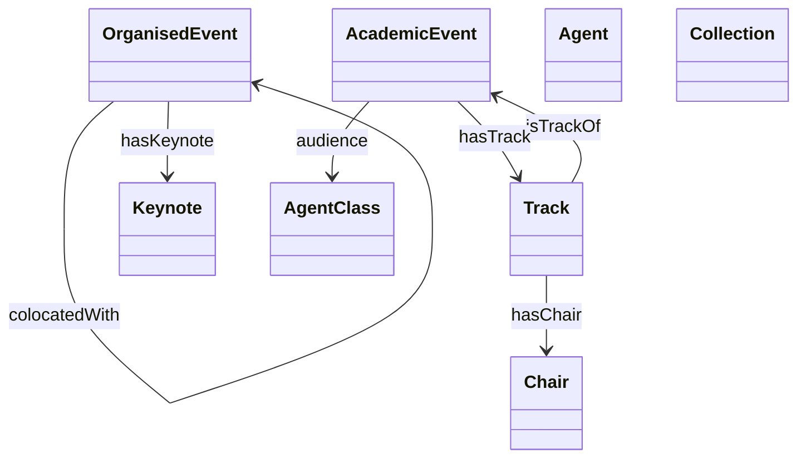

```mermaid
	classDiagram

    
    class OrganisedEvent {
    
    }

    class AcademicEvent {
    
    }

    class Agent {
    
    }

    class Collection {
    
    }

    class Track {
    
    }


Track  --> AcademicEvent   :isTrackOf  

OrganisedEvent  --> OrganisedEvent   :colocatedWith  

AcademicEvent  --> Track   :hasTrack  

OrganisedEvent  --> Keynote   :hasKeynote  

AcademicEvent  --> AgentClass   :audience  

Track  --> Chair   :hasChair  

```