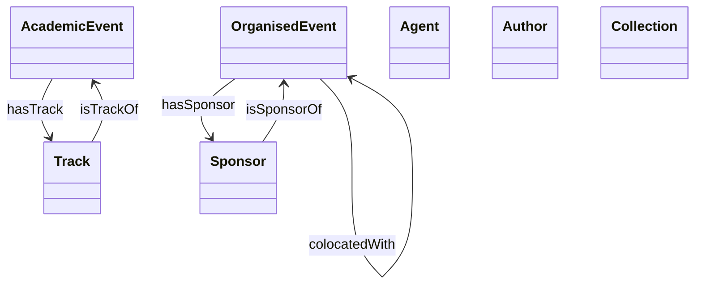

```mermaid
	classDiagram

    
    class `OrganisedEvent` {
    
    }

    class `AcademicEvent` {
    
    }

    class `Agent` {
    
    }

    class `Author` {
    
    }

    class `Track` {
    
    }

    class `Collection` {
    
    }

    class `Sponsor` {
    
    }


`Sponsor`  --> `OrganisedEvent`   :isSponsorOf  

`Track`  --> `AcademicEvent`   :isTrackOf  

`OrganisedEvent`  --> `OrganisedEvent`   :colocatedWith  

`AcademicEvent`  --> `Track`   :hasTrack  

`OrganisedEvent`  --> `Sponsor`   :hasSponsor  

```