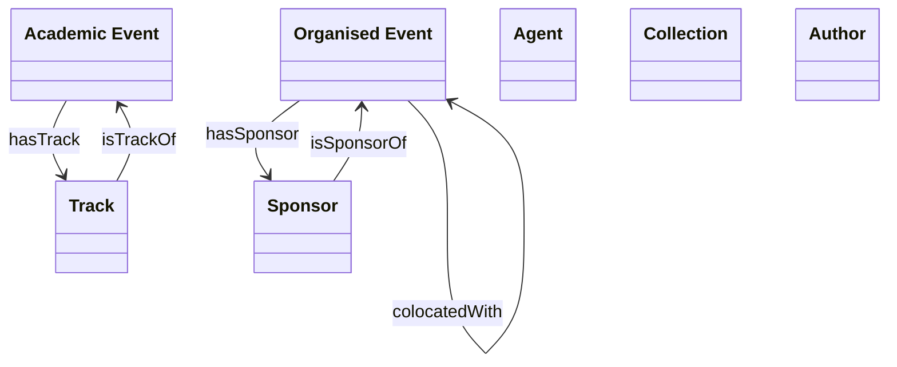

```mermaid
	classDiagram

    
    class `Organised Event` {
    
    }

    class `Academic Event` {
    
    }

    class `Agent` {
    
    }

    class `Track` {
    
    }

    class `Collection` {
    
    }

    class `Sponsor` {
    
    }

    class `Author` {
    
    }


`Academic Event`  --> `Track`   :hasTrack  

`Track`  --> `Academic Event`   :isTrackOf  

`Sponsor`  --> `Organised Event`   :isSponsorOf  

`Organised Event`  --> `Organised Event`   :colocatedWith  

`Organised Event`  --> `Sponsor`   :hasSponsor  

```