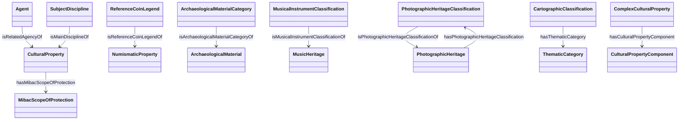

```mermaid
	classDiagram

    
    class CulturalProperty {
    
    }

    class CartographicClassification {
    
    }

    class Agent {
    
    }

    class NumismaticProperty {
    
    }

    class PhotographicHeritageClassification {
    
    }

    class SubjectDiscipline {
    
    }

    class ArchaeologicalMaterial {
    
    }

    class ComplexCulturalProperty {
    
    }

    class MusicHeritage {
    
    }

    class PhotographicHeritage {
    
    }


MusicalInstrumentClassification  --> MusicHeritage   :isMusicalInstrumentClassificationOf  

CulturalProperty  --> MibacScopeOfProtection   :hasMibacScopeOfProtection  

CartographicClassification  --> ThematicCategory   :hasThematicCategory  

Agent  --> CulturalProperty   :isRelatedAgencyOf  

SubjectDiscipline  --> CulturalProperty   :isMainDisciplineOf  

ArchaeologicalMaterialCategory  --> ArchaeologicalMaterial   :isArchaeologicalMaterialCategoryOf  

ReferenceCoinLegend  --> NumismaticProperty   :isReferenceCoinLegendOf  

ComplexCulturalProperty  --> CulturalPropertyComponent   :hasCulturalPropertyComponent  

PhotographicHeritageClassification  --> PhotographicHeritage   :isPhotographicHeritageClassificationOf  

PhotographicHeritage  --> PhotographicHeritageClassification   :hasPhotographicHeritageClassification  

```