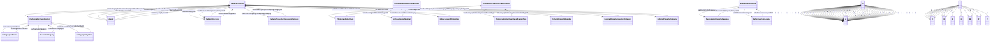

```mermaid
	classDiagram

    
    class CulturalProperty {
    
    }

    class CartographicClassification {
    
    }

    class Agent {
    
    }

    class SubjectDiscipline {
    
    }

    class PhotographicHeritageClassification {
    
    }

    class NumismaticProperty {
    
    }

    class ArchaeologicalMaterialCategory {
    
    }

    class CartographicSymbol {
    
    }

    class CartographicTheme {
    
    }

    class CulturalPropertyCataloguingCategory {
    
    }


CartographicTheme  --> CartographicClassification   :isCartographicThemeOf  

PhotographicHeritageClassification  --> PhotographicHeritage   :isPhotographicHeritageClassificationOf  

CulturalProperty  --> Agent   :hasCataloguingAgency  

ArchaeologicalMaterial  --> ArchaeologicalMaterialCategory   :hasArchaeologicalMaterialCategory  

CulturalProperty  --> MibacScopeOfProtection   :hasMibacScopeOfProtection  

PhotographicHeritageClassification  --> PhotographicHeritageClassificationType   :hasPhotographicHeritageClassificationType  

CulturalPropertyResidual  --> CulturalProperty   :isCulturalPropertyResidualOf  

MibacScopeOfProtection  --> CulturalProperty   :isMibacScopeOfProtectionOf  

Agent  --> CulturalProperty   :isRelatedAgencyOf  

CulturalProperty  --> CulturalPropertyInventoryCategory   :hasCulturalPropertyInventoryCategory  

CulturalProperty  --> Agent   :hasHeritageProtectionAgency  

SubjectDiscipline  --> CulturalProperty   :isMainDisciplineOf  

PhotographicHeritage  --> PhotographicHeritageClassification   :hasPhotographicHeritageClassification  

CulturalPropertyCategory  --> CulturalProperty   :isCulturalPropertyCategoryOf  

NumismaticProperty  --> NumismaticPropertyCategory   :hasNumismaticPropertyCategory  

CartographicClassification  --> CulturalProperty   :isCartographicClassificationOf  

CulturalProperty  --> SubjectDiscipline   :hasMainDiscipline  

NumismaticPropertyCategory  --> NumismaticProperty   :isNumismaticPropertyCategoryOf  

Agent  --> CulturalProperty   :isHeritageProtectionAgencyOf  

CulturalProperty  --> CulturalPropertyResidual   :hasCulturalPropertyResidual  

ArchaeologicalMaterialCategory  --> ArchaeologicalMaterial   :isArchaeologicalMaterialCategoryOf  

CulturalProperty  --> Agent   :hasRelatedAgency  

CartographicClassification  --> CartographicTheme   :hasCartographicTheme  

NumismaticProperty  --> ReferenceCoinLegend   :hasReferenceCoinLegend  

CulturalProperty  --> CulturalPropertyCataloguingCategory   :hasCulturalPropertyCataloguingCategory  

CartographicClassification  --> ThematicCategory   :hasThematicCategory  

CulturalPropertyCataloguingCategory  --> CulturalProperty   :isCulturalPropertyCataloguingCategoryOf  

CulturalProperty  --> CulturalPropertyCategory   :hasCulturalPropertyCategory  

PhotographicHeritageClassificationType  --> PhotographicHeritageClassification   :isPhotographicHeritageClassificationTypeOf  

CartographicSymbol  --> CartographicClassification   :isCartographicSymbolOf  

ReferenceCoinLegend  --> NumismaticProperty   :isReferenceCoinLegendOf  

Agent  --> CulturalProperty   :isCataloguingAgencyOf  

SubjectDiscipline  --> CulturalProperty   :isAlternativeDisciplineOf  

CulturalProperty  --> SubjectDiscipline   :hasAlternativeDiscipline  

CulturalProperty  --> CartographicClassification   :hasCartographicClassification  

CartographicClassification  --> CartographicSymbol   :hasCartographicSymbol  

CulturalPropertyInventoryCategory  --> CulturalProperty   :isCulturalPropertyInventoryCategoryOf  

ThematicCategory  --> CartographicClassification   :isThematicCategoryOf  

h  --> s   :a  

h  --> s   :a  

h  --> s   :a  

h  --> s   :a  

h  --> s   :a  

h  --> s   :a  

h  --> s   :a  

i  --> C   :s  

i  --> R   :s  

h  --> s   :a  

h  --> s   :a  

i  --> A   :s  

h  --> s   :a  

i  --> C   :s  

h  --> s   :a  

h  --> s   :a  

h  --> s   :a  

h  --> s   :a  

h  --> s   :a  

h  --> s   :a  

i  --> C   :s  

h  --> s   :a  

i  --> C   :s  

i  --> R   :s  

h  --> s   :a  

h  --> s   :a  

h  --> s   :a  

h  --> s   :a  

i  --> N   :s  

h  --> s   :a  

i  --> C   :s  

h  --> s   :a  

h  --> s   :a  

h  --> s   :a  

h  --> s   :a  

i  --> C   :s  

h  --> s   :a  

h  --> s   :a  

h  --> s   :a  

h  --> s   :a  

h  --> s   :a  

h  --> s   :a  

h  --> s   :a  

h  --> s   :a  

i  --> R   :s  

i  --> C   :s  

h  --> s   :a  

h  --> s   :a  

h  --> s   :a  

h  --> s   :a  

i  --> M   :s  

h  --> s   :a  

h  --> s   :a  

h  --> s   :a  

h  --> s   :a  

h  --> s   :a  

h  --> s   :a  

i  --> P   :s  

h  --> s   :a  

h  --> s   :a  

i  --> C   :s  

i  --> P   :s  

h  --> s   :a  

h  --> s   :a  

i  --> M   :s  

i  --> T   :s  

h  --> s   :a  

```