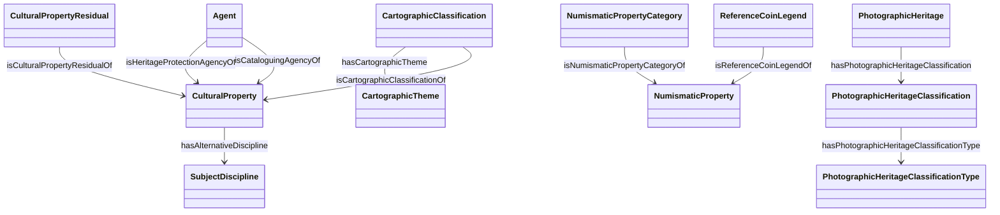

```mermaid
	classDiagram

    
    class CulturalProperty {
    
    }

    class CartographicClassification {
    
    }

    class Agent {
    
    }

    class NumismaticProperty {
    
    }

    class PhotographicHeritageClassification {
    
    }


CartographicClassification  --> CartographicTheme   :hasCartographicTheme  

PhotographicHeritage  --> PhotographicHeritageClassification   :hasPhotographicHeritageClassification  

NumismaticPropertyCategory  --> NumismaticProperty   :isNumismaticPropertyCategoryOf  

CulturalProperty  --> SubjectDiscipline   :hasAlternativeDiscipline  

CulturalPropertyResidual  --> CulturalProperty   :isCulturalPropertyResidualOf  

CartographicClassification  --> CulturalProperty   :isCartographicClassificationOf  

Agent  --> CulturalProperty   :isHeritageProtectionAgencyOf  

Agent  --> CulturalProperty   :isCataloguingAgencyOf  

PhotographicHeritageClassification  --> PhotographicHeritageClassificationType   :hasPhotographicHeritageClassificationType  

ReferenceCoinLegend  --> NumismaticProperty   :isReferenceCoinLegendOf  

```