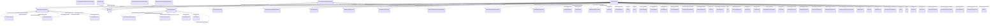

```mermaid
	classDiagram

    
    class CulturalProperty {
    
    }

    class CartographicClassification {
    
    }

    class Agent {
    
    }

    class NumismaticProperty {
    
    }

    class PhotographicHeritageClassification {
    
    }


PhotographicHeritage  --> PhotographicHeritageClassification   :hasPhotographicHeritageClassification  

CulturalProperty  --> CulturalPropertyCataloguingCategory   :hasCulturalPropertyCataloguingCategory  

ThematicCategory  --> CartographicClassification   :isThematicCategoryOf  

SubjectDiscipline  --> CulturalProperty   :isMainDisciplineOf  

CartographicClassification  --> CartographicSymbol   :hasCartographicSymbol  

MibacScopeOfProtection  --> CulturalProperty   :isMibacScopeOfProtectionOf  

CulturalPropertyCategory  --> CulturalProperty   :isCulturalPropertyCategoryOf  

CulturalProperty  --> MibacScopeOfProtection   :hasMibacScopeOfProtection  

CulturalPropertyCataloguingCategory  --> CulturalProperty   :isCulturalPropertyCataloguingCategoryOf  

CartographicClassification  --> CulturalProperty   :isCartographicClassificationOf  

Agent  --> CulturalProperty   :isRelatedAgencyOf  

CulturalProperty  --> Agent   :hasCataloguingAgency  

CartographicSymbol  --> CartographicClassification   :isCartographicSymbolOf  

PhotographicHeritageClassification  --> PhotographicHeritageClassificationType   :hasPhotographicHeritageClassificationType  

CartographicTheme  --> CartographicClassification   :isCartographicThemeOf  

Agent  --> CulturalProperty   :isCataloguingAgencyOf  

CulturalProperty  --> CulturalPropertyCategory   :hasCulturalPropertyCategory  

CartographicClassification  --> CartographicTheme   :hasCartographicTheme  

CulturalProperty  --> CartographicClassification   :hasCartographicClassification  

CulturalPropertyInventoryCategory  --> CulturalProperty   :isCulturalPropertyInventoryCategoryOf  

CulturalProperty  --> SubjectDiscipline   :hasAlternativeDiscipline  

CulturalPropertyResidual  --> CulturalProperty   :isCulturalPropertyResidualOf  

CulturalProperty  --> Agent   :hasRelatedAgency  

CulturalProperty  --> Agent   :hasHeritageProtectionAgency  

SubjectDiscipline  --> CulturalProperty   :isAlternativeDisciplineOf  

CulturalProperty  --> CulturalPropertyInventoryCategory   :hasCulturalPropertyInventoryCategory  

NumismaticProperty  --> NumismaticPropertyCategory   :hasNumismaticPropertyCategory  

CulturalProperty  --> CulturalPropertyResidual   :hasCulturalPropertyResidual  

CartographicClassification  --> ThematicCategory   :hasThematicCategory  

Agent  --> CulturalProperty   :isHeritageProtectionAgencyOf  

NumismaticPropertyCategory  --> NumismaticProperty   :isNumismaticPropertyCategoryOf  

PhotographicHeritageClassificationType  --> PhotographicHeritageClassification   :isPhotographicHeritageClassificationTypeOf  

NumismaticProperty  --> ReferenceCoinLegend   :hasReferenceCoinLegend  

PhotographicHeritageClassification  --> PhotographicHeritage   :isPhotographicHeritageClassificationOf  

ReferenceCoinLegend  --> NumismaticProperty   :isReferenceCoinLegendOf  

CulturalProperty  --> SubjectDiscipline   :hasMainDiscipline  

CulturalProperty  --> DesignationInTime   :hasDesignationInTime  

CulturalProperty  --> Documentation   :hasDocumentation  

CulturalProperty  --> TimeIndexedTypedLocation   :hasTimeIndexedTypedLocation  

CulturalProperty  --> Acquisition   :hasAcquisition  

CulturalProperty  --> FunctionalPurpose   :hasFunctionalPurpose  

AlternativeMusicalInstrumentClassification  --> Agent   :hasAuthor  

CulturalPropertyCategory  --> CulturalProperty   :isCulturalPropertyCategoryOf  

CulturalProperty  --> Subject   :hasSubject  

CulturalProperty  --> Survey   :hasSurvey  

NumismaticPropertyCategory  --> NumismaticProperty   :isNumismaticPropertyCategoryOf  

CulturalProperty  --> DetectionMethod   :hasDetectionMethod  

CulturalProperty  --> CulturalPropertyResidual   :hasCulturalPropertyResidual  

CulturalProperty  --> CadastralIdentity   :hasCadastralIdentity  

CulturalProperty  --> AffixedElement   :hasAffixedElement  

CulturalProperty  --> ConservationStatus   :hasConservationStatus  

CulturalProperty  --> CulturalPropertyAvailability   :hasCulturalPropertyAvailability  

ThematicCategory  --> CartographicClassification   :isThematicCategoryOf  

CulturalProperty  --> ChangeOfAvailability   :hasChangeOfAvailability  

CulturalProperty  --> Inventory   :hasInventory  

CulturalProperty  --> InformationForm   :isRelatedToInformationForm  

PhotographicHeritage  --> PhotographicHeritageClassification   :hasPhotographicHeritageClassification  

CulturalProperty  --> Use   :hasUse  

CulturalProperty  --> CollectionMembership   :isMemberOfCollection  

PhotographicHeritageClassification  --> PhotographicHeritageClassificationType   :hasPhotographicHeritageClassificationType  

CulturalProperty  --> Bibliography   :hasBibliography  

CulturalProperty  --> LegalSituation   :hasLegalSituation  

CulturalProperty  --> CulturalEntityTechnicalStatus   :hasTechnicalStatus  

CartographicSymbol  --> CartographicClassification   :isCartographicSymbolOf  

PhotographicHeritageClassificationType  --> PhotographicHeritageClassification   :isPhotographicHeritageClassificationTypeOf  

CartographicClassification  --> ThematicCategory   :hasThematicCategory  

CulturalProperty  --> Intervention   :hasIntervention  

CulturalProperty  --> CulturalPropertyType   :hasCulturalPropertyType  

CulturalProperty  --> RelatedWorkSituation   :hasRelatedWorkSituation  

CulturalProperty  --> MeasurementCollection   :hasMeasurementCollection  

CulturalProperty  --> ExportImportCertification   :hasExportImportCertification  

MusicHeritage  --> Agent   :hasMusicalEnsemble  

MusicHeritage  --> Agent   :hasMusician  

ReferenceCoinLegend  --> NumismaticProperty   :isReferenceCoinLegendOf  

CulturalProperty  --> IconographicOrDecorativeApparatus   :hasIconographicOrDecorativeApparatus  

CartographicClassification  --> CulturalProperty   :isCartographicClassificationOf  

CartographicClassification  --> CulturalProperty   :isCartographicClassificationOf  

NumismaticPropertyFunctionalCategory  --> NumismaticProperty   :isNumismaticPropertyCategoryOf  

CulturalProperty  --> AdditionalForm   :isRelatedToAdditionalForm  

CulturalPropertyCataloguingCategory  --> CulturalProperty   :isCulturalPropertyCataloguingCategoryOf  

CulturalProperty  --> Geometry   :hasGeometry  

CulturalProperty  --> TypeOfContext   :hasTypeOfContext  

NumismaticProperty  --> NumismaticSeries   :isCoinMemberOf  

NumismaticProperty  --> NumismaticProperty   :hasNumismaticPropertyCategory  

NumismaticProperty  --> NumismaticProperty   :hasNumismaticPropertyCategory  

CulturalProperty  --> CulturalPropertyComponent   :hasCulturalPropertyComponent  

MibacScopeOfProtection  --> CulturalProperty   :isMibacScopeOfProtectionOf  

CulturalProperty  --> Dating   :hasDating  

CulturalProperty  --> Title   :hasTitle  

CulturalPropertyInventoryCategory  --> CulturalProperty   :isCulturalPropertyInventoryCategoryOf  

CartographicClassification  --> CartographicSymbol   :hasCartographicSymbol  

CulturalProperty  --> Orientation   :hasOrientation  

PhotographicHeritageClassification  --> PhotographicHeritage   :isPhotographicHeritageClassificationOf  

CulturalPropertyResidual  --> CulturalProperty   :isCulturalPropertyResidualOf  

CulturalProperty  --> Commission   :hasCommission  

CulturalProperty  --> AuthorshipAttribution   :hasAuthorshipAttribution  

CartographicClassification  --> CartographicTheme   :hasCartographicTheme  

NumismaticProperty  --> CoinIssuance   :hasCoinIssuance  

CulturalProperty  --> CulturalPropertyAccessibility   :hasCulturalPropertyAccessibility  

CulturalProperty  --> ProtectiveMeasure   :hasProtectiveMeasure  

CulturalProperty  --> UrbanPlanningInstrument   :hasUrbanPlanningInstrument  

CulturalProperty  --> Address   :hasCulturalPropertyAddress  

NumismaticPropertyTypologicalCategory  --> NumismaticProperty   :isNumismaticPropertyCategoryOf  

CulturalProperty  --> TimeIndexedTypedLocation   :hasLocationSubject  

```