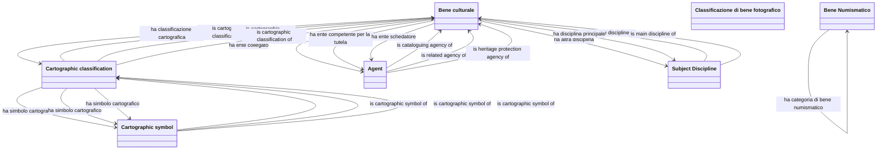

```mermaid
	classDiagram

    
    class `Bene culturale` {
    
    }

    class `Cartographic classification` {
    
    }

    class `Agent` {
    
    }

    class `Classificazione di bene fotografico` {
    
    }

    class `Bene Numismatico` {
    
    }

    class `Subject Discipline` {
    
    }

    class `Cartographic symbol` {
    
    }


`Bene culturale`  --> `Cartographic classification`   :ha classificazione cartografica  

`Agent`  --> `Bene culturale`   :is cataloguing agency of  

`Subject Discipline`  --> `Bene culturale`   :is alternative discipline of  

`Agent`  --> `Bene culturale`   :is related agency of  

`Cartographic classification`  --> `Cartographic symbol`   :ha simbolo cartografico  

`Bene culturale`  --> `Agent`   :ha ente collegato  

`Bene culturale`  --> `Subject Discipline`   :ha altra disciplina  

`Cartographic symbol`  --> `Cartographic classification`   :is cartographic symbol of  

`Subject Discipline`  --> `Bene culturale`   :is main discipline of  

`Cartographic classification`  --> `Bene culturale`   :is cartographic classification of  

`Agent`  --> `Bene culturale`   :is heritage protection agency of  

`Bene culturale`  --> `Subject Discipline`   :ha disciplina principale  

`Bene culturale`  --> `Agent`   :ha ente competente per la tutela  

`Bene culturale`  --> `Agent`   :ha ente schedatore  

`Cartographic classification`  --> `Cartographic symbol`   :ha simbolo cartografico  

`Cartographic classification`  --> `Cartographic symbol`   :ha simbolo cartografico  

`Cartographic symbol`  --> `Cartographic classification`   :is cartographic symbol of  

`Cartographic symbol`  --> `Cartographic classification`   :is cartographic symbol of  

`Cartographic classification`  --> `Bene culturale`   :is cartographic classification of  

`Cartographic classification`  --> `Bene culturale`   :is cartographic classification of  

`Bene Numismatico`  --> `Bene Numismatico`   :ha categoria di bene numismatico  

`Bene Numismatico`  --> `Bene Numismatico`   :ha categoria di bene numismatico  

```