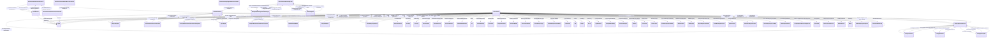

```mermaid
	classDiagram

    
    class Bene culturale {
    
    }

    class Cartographic classification {
    
    }

    class Agent {
    
    }

    class Classificazione di bene fotografico {
    
    }

    class Bene Numismatico {
    
    }

    class SubjectDiscipline {
    
    }

    class Classificazione di strumento musicale {
    
    }


Bene culturale  --> Agent   :ha ente competente per la tutela  

Agent  --> Bene culturale   :is heritage protection agency of  

Classificazione di bene numismatico  --> Bene Numismatico   :is numismatic property category of  

Bene culturale  --> Agent   :ha ente collegato  

Bene culturale  --> Agent   :ha ente schedatore  

Bene culturale  --> Categoria di bene culturale basata su catalogazione   :ha categoria di bene culturale basata su catalogazione  

Categoria tematica  --> Cartographic classification   :is thematic category of  

Categoria di bene culturale basata su catalogazione  --> Bene culturale   :is cultural property cataloguing category of  

Bene Numismatico  --> Legenda tipo   :ha legenda tipo  

SubjectDiscipline  --> Bene culturale   :is main discipline of  

Cartographic classification  --> Categoria tematica   :ha categoria tematica  

Categoria di bene culturale basata su repertorio  --> Bene culturale   :is cultural property inventory category of  

Bene culturale  --> SubjectDiscipline   :ha disciplina principale  

Bene Numismatico  --> Classificazione di bene numismatico   :ha categoria di bene numismatico  

Classificazione di strumento musicale  --> Bene Musicale   :is musical instrument classification of  

Classificazione di bene fotografico  --> Photographic heritage classification type   :ha tipo di classificazione di bene fotografico  

SubjectDiscipline  --> Bene culturale   :is alternative discipline of  

Ambito di tutela MiBAC  --> Bene culturale   :is MiBAC scope of protection of  

Bene culturale  --> Ambito di tutela MiBAC   :ha ambito di tutela  

Bene culturale  --> Categoria del bene   :ha categoria  

Bene culturale  --> Cultural Property Residual   :ha parte residuale di bene culturale  

Cartographic classification  --> Bene culturale   :is cartographic classification of  

Bene culturale  --> Cartographic classification   :ha classificazione cartografica  

Cartographic symbol  --> Cartographic classification   :is cartographic symbol of  

Agent  --> Bene culturale   :is related agency of  

Cartographic theme  --> Cartographic classification   :is cartographic theme of  

Classificazione di bene fotografico  --> Bene Fotografico   :is photographic heritage classification of  

Legenda tipo  --> Bene Numismatico   :is reference coin legend of  

Bene culturale  --> SubjectDiscipline   :ha altra disciplina  

Agent  --> Bene culturale   :is cataloguing agency of  

Bene Musicale  --> Classificazione di strumento musicale   :ha classificazione di strumento musicale  

Photographic heritage classification type  --> Classificazione di bene fotografico   :is photographic heritage classification type of  

Cultural Property Residual  --> Bene culturale   :is cultural property residual of  

Categoria del bene  --> Bene culturale   :is cultural property category of  

Bene Fotografico  --> Classificazione di bene fotografico   :ha classificazione di bene fotografico  

Cartographic classification  --> Cartographic theme   :ha tema cartografico  

Bene culturale  --> Categoria di bene culturale basata su repertorio   :ha categoria basata su repertorio  

Cartographic classification  --> Cartographic symbol   :ha simbolo cartografico  

Bene Numismatico  --> NumismaticSeries   :isCoinMemberOf  

Classificazione funzionale di bene numismatico  --> Bene Numismatico   :is numismatic property category of  

Bene Musicale  --> Agent   :hasMusician  

Bene culturale  --> Inventory   :hasInventory  

Bene Musicale  --> Agent   :hasMusicalEnsemble  

Classificazione di bene numismatico  --> Bene Numismatico   :is numismatic property category of  

Bene culturale  --> Geometry   :hasGeometry  

Cartographic classification  --> Cartographic symbol   :ha simbolo cartografico  

Bene culturale  --> Documentation   :hasDocumentation  

Bene culturale  --> InformationForm   :isRelatedToInformationForm  

Categoria di bene culturale basata su catalogazione  --> Bene culturale   :is cultural property cataloguing category of  

Categoria tematica  --> Cartographic classification   :is thematic category of  

Bene culturale  --> ProtectiveMeasure   :hasProtectiveMeasure  

Cartographic classification  --> Categoria tematica   :ha categoria tematica  

Bene culturale  --> RelatedWorkSituation   :hasRelatedWorkSituation  

Bene culturale  --> Use   :hasUse  

Bene culturale  --> CadastralIdentity   :hasCadastralIdentity  

Categoria di bene culturale basata su repertorio  --> Bene culturale   :is cultural property inventory category of  

Bene culturale  --> Orientation   :hasOrientation  

Bene culturale  --> DesignationInTime   :hasDesignationInTime  

Bene culturale  --> DetectionMethod   :hasDetectionMethod  

Classificazione di strumento musicale  --> Bene Musicale   :is musical instrument classification of  

Classificazione di bene fotografico  --> Photographic heritage classification type   :ha tipo di classificazione di bene fotografico  

Bene culturale  --> ConservationStatus   :hasConservationStatus  

Ambito di tutela MiBAC  --> Bene culturale   :is MiBAC scope of protection of  

Bene culturale  --> CulturalPropertyType   :hasCulturalPropertyType  

Bene culturale  --> CulturalEntityTechnicalStatus   :hasTechnicalStatus  

Bene culturale  --> Commission   :hasCommission  

Bene culturale  --> Title   :hasTitle  

Bene culturale  --> Subject   :hasSubject  

Bene culturale  --> Survey   :hasSurvey  

Bene culturale  --> LegalSituation   :hasLegalSituation  

Bene culturale  --> ChangeOfAvailability   :hasChangeOfAvailability  

Alternative musical instrument classification  --> Agent   :hasAuthor  

Bene culturale  --> FunctionalPurpose   :hasFunctionalPurpose  

Bene culturale  --> Address   :hasCulturalPropertyAddress  

Bene culturale  --> Intervention   :hasIntervention  

Bene Numismatico  --> CoinIssuance   :hasCoinIssuance  

Bene culturale  --> CulturalPropertyAvailability   :hasCulturalPropertyAvailability  

Bene culturale  --> AdditionalForm   :isRelatedToAdditionalForm  

Bene culturale  --> Cultural Property Residual   :ha parte residuale di bene culturale  

Bene culturale  --> Bibliography   :hasBibliography  

Cartographic classification  --> Bene culturale   :is cartographic classification of  

Bene culturale  --> ExportImportCertification   :hasExportImportCertification  

Bene culturale  --> UrbanPlanningInstrument   :hasUrbanPlanningInstrument  

Cartographic classification  --> Bene culturale   :is cartographic classification of  

Bene culturale  --> TypeOfContext   :hasTypeOfContext  

Cartographic symbol  --> Cartographic classification   :is cartographic symbol of  

Bene culturale  --> TimeIndexedTypedLocation   :hasTimeIndexedTypedLocation  

Bene culturale  --> CulturalPropertyAccessibility   :hasCulturalPropertyAccessibility  

Classificazione tipologica di bene numismatico  --> Bene Numismatico   :is numismatic property category of  

Bene culturale  --> AuthorshipAttribution   :hasAuthorshipAttribution  

Bene culturale  --> TimeIndexedTypedLocation   :hasLocationSubject  

Classificazione di bene fotografico  --> Bene Fotografico   :is photographic heritage classification of  

Legenda tipo  --> Bene Numismatico   :is reference coin legend of  

Bene Numismatico  --> Bene Numismatico   :ha categoria di bene numismatico  

Bene culturale  --> IconographicOrDecorativeApparatus   :hasIconographicOrDecorativeApparatus  

Bene culturale  --> Acquisition   :hasAcquisition  

Photographic heritage classification type  --> Classificazione di bene fotografico   :is photographic heritage classification type of  

Bene culturale  --> MeasurementCollection   :hasMeasurementCollection  

Bene culturale  --> AffixedElement   :hasAffixedElement  

Categoria del bene  --> Bene culturale   :is cultural property category of  

Cultural Property Residual  --> Bene culturale   :is cultural property residual of  

Bene Fotografico  --> Classificazione di bene fotografico   :ha classificazione di bene fotografico  

Bene Musicale  --> Classificazione di strumento musicale   :ha classificazione di strumento musicale  

Bene Numismatico  --> Bene Numismatico   :ha categoria di bene numismatico  

Bene culturale  --> Dating   :hasDating  

Cartographic classification  --> Cartographic theme   :ha tema cartografico  

Bene culturale  --> Cultural Property Component   :ha parte componente di bene culturale  

Bene culturale  --> CollectionMembership   :isMemberOfCollection  

```