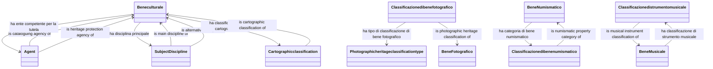

```mermaid
	classDiagram

    
    class Bene culturale {
    
    }

    class Cartographic classification {
    
    }

    class Agent {
    
    }

    class Classificazione di bene fotografico {
    
    }

    class Bene Numismatico {
    
    }

    class SubjectDiscipline {
    
    }

    class Classificazione di strumento musicale {
    
    }


Agent  --> Bene culturale   :is cataloguing agency of  

Bene culturale  --> Agent   :ha ente competente per la tutela  

Bene culturale  --> SubjectDiscipline   :ha disciplina principale  

SubjectDiscipline  --> Bene culturale   :is main discipline of  

SubjectDiscipline  --> Bene culturale   :is alternative discipline of  

Agent  --> Bene culturale   :is heritage protection agency of  

Bene culturale  --> Cartographic classification   :ha classificazione cartografica  

Cartographic classification  --> Bene culturale   :is cartographic classification of  

Classificazione di bene numismatico  --> Bene Numismatico   :is numismatic property category of  

Bene Numismatico  --> Classificazione di bene numismatico   :ha categoria di bene numismatico  

Classificazione di bene fotografico  --> Photographic heritage classification type   :ha tipo di classificazione di bene fotografico  

Classificazione di bene fotografico  --> Bene Fotografico   :is photographic heritage classification of  

Bene Musicale  --> Classificazione di strumento musicale   :ha classificazione di strumento musicale  

Classificazione di strumento musicale  --> Bene Musicale   :is musical instrument classification of  

```