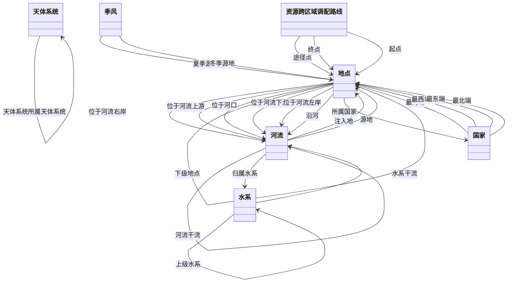

```mermaid
	classDiagram

    
    class `地点` {
    
    }

    class `河流` {
    
    }

    class `国家` {
    
    }

    class `天体系统` {
    
    }

    class `水系` {
    
    }

    class `季风` {
    
    }

    class `资源跨区域调配路线` {
    
    }


`天体系统`  --> `天体系统`   :天体系统包含天体系统  

`地点`  --> `河流`   :位于河流右岸  

`河流`  --> `河流`   :包含支流  

`季风`  --> `地点`   :夏季源地  

`国家`  --> `地点`   :最南端  

`资源跨区域调配路线`  --> `地点`   :途径点  

`资源跨区域调配路线`  --> `地点`   :终点  

`河流`  --> `地点`   :注入地  

`地点`  --> `河流`   :位于河流上游  

`国家`  --> `地点`   :最西端  

`地点`  --> `河流`   :位于河口  

`国家`  --> `地点`   :最东端  

`季风`  --> `地点`   :冬季源地  

`河流`  --> `水系`   :归属水系  

`地点`  --> `地点`   :上级地点  

`地点`  --> `河流`   :位于河流下游  

`国家`  --> `地点`   :最北端  

`水系`  --> `河流`   :水系干流  

`地点`  --> `河流`   :位于河流左岸  

`天体系统`  --> `天体系统`   :天体系统所属天体系统  

`资源跨区域调配路线`  --> `地点`   :起点  

`地点`  --> `河流`   :沿河  

`河流`  --> `河流`   :河流干流  

`地点`  --> `国家`   :所属国家  

`河流`  --> `地点`   :源地  

`水系`  --> `水系`   :上级水系  

`地点`  --> `地点`   :下级地点  

```