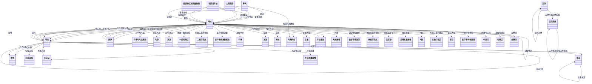

```mermaid
	classDiagram

    
    class 地点 {
    
    }

    class 河流 {
    
    }

    class 国家 {
    
    }

    class 天体系统 {
    
    }

    class 水系 {
    
    }

    class 天体 {
    
    }

    class 季风 {
    
    }


地点  --> 地点   :下级地点  

地点  --> 月平均气温属性   :月平均气温  

地点  --> 风带   :所处风带  

河流  --> 河流   :包含支流  

河流  --> 水体   :补给水源  

季风  --> 地点   :夏季源地  

地点  --> 河流   :位于河流下游  

资源跨区域调配路线  --> 地点   :终点  

天体系统  --> 天体系统   :天体系统所属天体系统  

地点  --> 河流   :位于河流右岸  

地点  --> 洋流   :影响洋流  

地点  --> 一级行政区   :所属一级行政区  

地点  --> 二级行政区   :所属二级行政区  

地点  --> 废弃物排放量属性   :废弃物排放量  

地点  --> 半球   :上级半球  

力的作用  --> 地点   :分布地区  

地区分界线  --> 地点   :途径实体  

河流  --> 河流流域   :包含流域  

地点  --> 湖泊   :沿湖  

天体  --> 天体系统   :天体所属天体系统  

地点  --> 海域   :沿海  

水系  --> 河流   :水系干流  

河流  --> 地点   :注入地  

地点  --> 气候类型   :气候类型  

地点  --> 河流   :位于河流上游  

地点  --> 河流   :位于河流左岸  

天体系统  --> 天体系统   :天体系统包含天体系统  

地点  --> 土壤   :土壤类型  

水系  --> 水系   :上级水系  

方位描述  --> 地点   :地点  

地点  --> 风频属性   :风频  

地区分界线  --> 地点   :分界实体  

地点  --> 地点   :上级地点  

资源跨区域调配路线  --> 地点   :起点  

河流  --> 地点   :源地  

国家  --> 地点   :最南端  

地点  --> 农业地域类型   :农业地域类型  

地点  --> 四级行政区   :所属四级行政区  

河流  --> 水文站   :包含水文站  

河流  --> 月径流量属性   :月径流量  

地点  --> 河流   :沿河  

河流  --> 水系   :归属水系  

天体  --> 天体   :绕转天体  

河流  --> 河流   :河流干流  

地点  --> 温度带   :所属温度带  

地点  --> 月降水量属性   :月降水量  

地点  --> 河流   :位于河口  

地点  --> 时区   :时区  

水文站  --> 河流   :所属河流  

国家  --> 地点   :最北端  

地点  --> 三级行政区   :所属三级行政区  

地点  --> 岩石   :岩石类型  

季风  --> 气候类型   :相关气候类型  

河流  --> 水体   :汇入水系  

季风  --> 地点   :冬季源地  

地点  --> 方位描述   :方位  

资源跨区域调配路线  --> 地点   :途径点  

地点  --> 农作物种植属性   :农作物种植  

国家  --> 地点   :最东端  

地点  --> 国家   :所属国家  

地点  --> 气压带   :所处气压带  

国家  --> 地点   :最西端  

地点  --> 行政区   :上级行政区  

地点  --> 自然带   :自然带  

```