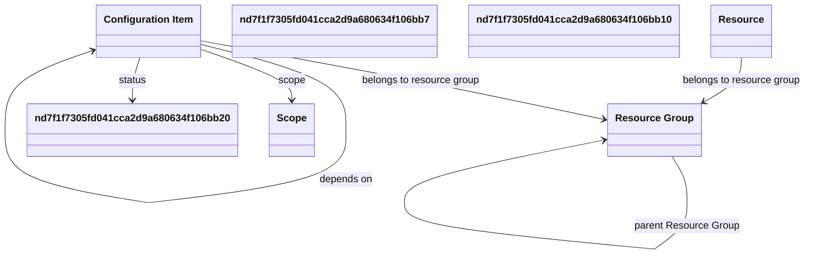

```mermaid
	classDiagram

    
    class `Configuration Item` {
    
    }

    class `Resource Group` {
    
    }

    class `nd7f1f7305fd041cca2d9a680634f106bb7` {
    
    }

    class `nd7f1f7305fd041cca2d9a680634f106bb10` {
    
    }

    class `Scope` {
    
    }

    class `Resource` {
    
    }

    class `nd7f1f7305fd041cca2d9a680634f106bb20` {
    
    }


`Resource Group`  --> `Resource Group`   :parent Resource Group  

`Configuration Item`  --> `Resource Group`   :belongs to resource group  

`Configuration Item`  --> `Configuration Item`   :depends on  

`Resource Group`  --> `Resource Group`   :parent Resource Group  

`Configuration Item`  --> `Scope`   :scope  

`Resource Group`  --> `Resource Group`   :parent Resource Group  

`Configuration Item`  --> `Configuration Item`   :depends on  

`Resource`  --> `Resource Group`   :belongs to resource group  

`Configuration Item`  --> `nd7f1f7305fd041cca2d9a680634f106bb20`   :status  

`Configuration Item`  --> `Configuration Item`   :depends on  

```