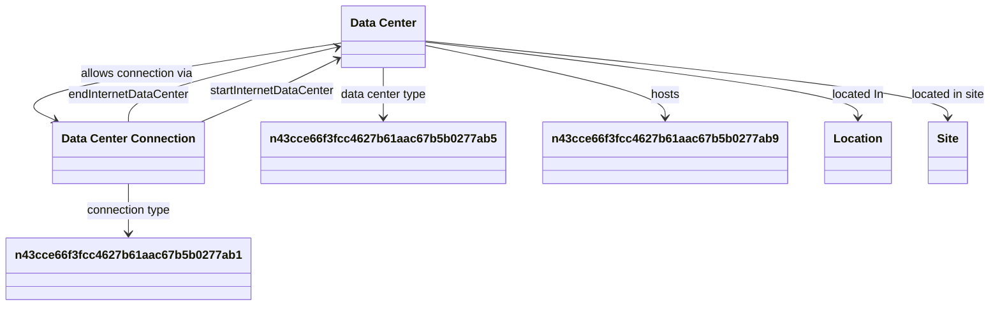

```mermaid
	classDiagram

    
    class `Data Center` {
    
    }

    class `Data Center Connection` {
    
    }

    class `n43cce66f3fcc4627b61aac67b5b0277ab1` {
    
    }

    class `n43cce66f3fcc4627b61aac67b5b0277ab5` {
    
    }

    class `n43cce66f3fcc4627b61aac67b5b0277ab9` {
    
    }

    class `Location` {
    
    }

    class `Site` {
    
    }


`Data Center`  --> `n43cce66f3fcc4627b61aac67b5b0277ab9`   :hosts  

`Data Center`  --> `Data Center Connection`   :allows connection via  

`Data Center Connection`  --> `Data Center`   :endInternetDataCenter  

`Data Center`  --> `Location`   :located In  

`Data Center`  --> `n43cce66f3fcc4627b61aac67b5b0277ab5`   :data center type  

`Data Center`  --> `Site`   :located in site  

`Data Center Connection`  --> `n43cce66f3fcc4627b61aac67b5b0277ab1`   :connection type  

`Data Center Connection`  --> `Data Center`   :startInternetDataCenter  

```