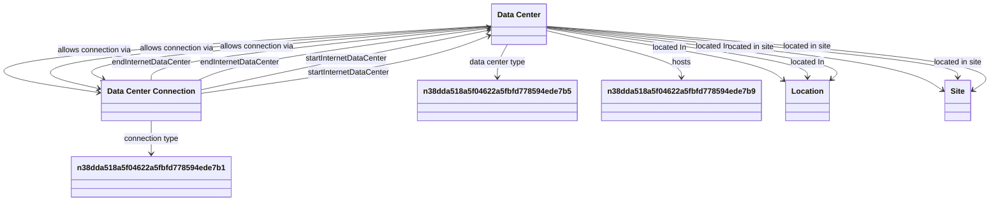

```mermaid
	classDiagram

    
    class `Data Center` {
    
    }

    class `Data Center Connection` {
    
    }

    class `n38dda518a5f04622a5fbfd778594ede7b1` {
    
    }

    class `n38dda518a5f04622a5fbfd778594ede7b5` {
    
    }

    class `n38dda518a5f04622a5fbfd778594ede7b9` {
    
    }

    class `Location` {
    
    }

    class `Site` {
    
    }


`Data Center`  --> `Data Center Connection`   :allows connection via  

`Data Center`  --> `n38dda518a5f04622a5fbfd778594ede7b9`   :hosts  

`Data Center`  --> `n38dda518a5f04622a5fbfd778594ede7b5`   :data center type  

`Data Center`  --> `Site`   :located in site  

`Data Center`  --> `Location`   :located In  

`Data Center Connection`  --> `n38dda518a5f04622a5fbfd778594ede7b1`   :connection type  

`Data Center`  --> `Data Center Connection`   :allows connection via  

`Data Center`  --> `Data Center Connection`   :allows connection via  

`Data Center Connection`  --> `Data Center`   :endInternetDataCenter  

`Data Center Connection`  --> `Data Center`   :endInternetDataCenter  

`Data Center`  --> `Site`   :located in site  

`Data Center`  --> `Site`   :located in site  

`Data Center`  --> `Location`   :located In  

`Data Center Connection`  --> `Data Center`   :startInternetDataCenter  

`Data Center Connection`  --> `Data Center`   :startInternetDataCenter  

`Data Center`  --> `Location`   :located In  

```