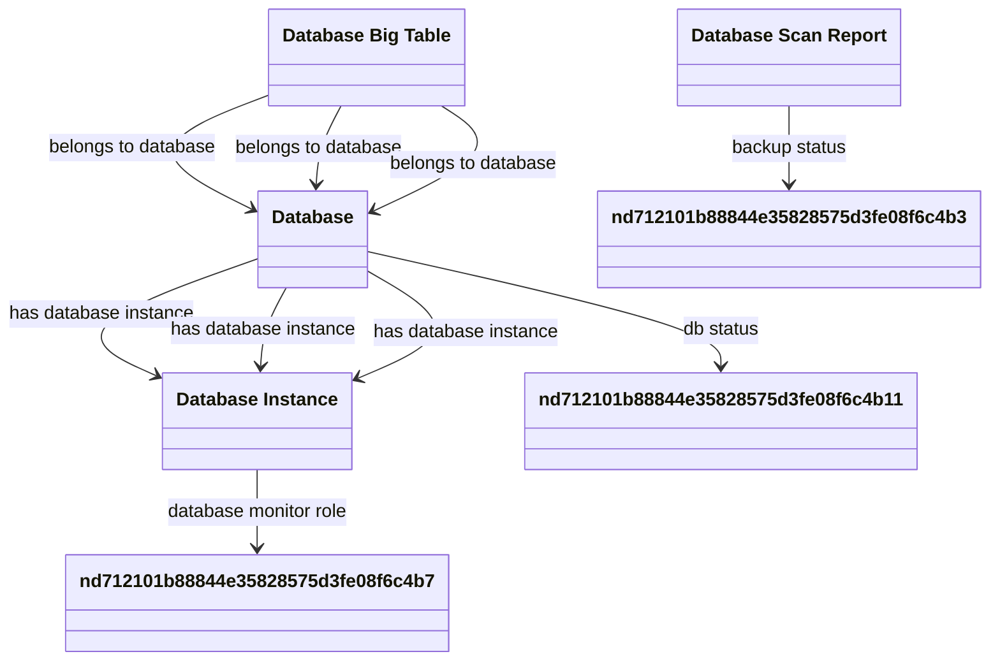

```mermaid
	classDiagram

    
    class `Database` {
    
    }

    class `Database Instance` {
    
    }

    class `Database Scan Report` {
    
    }

    class `Database Big Table` {
    
    }

    class `nd712101b88844e35828575d3fe08f6c4b3` {
    
    }

    class `nd712101b88844e35828575d3fe08f6c4b7` {
    
    }

    class `nd712101b88844e35828575d3fe08f6c4b11` {
    
    }


`Database Big Table`  --> `Database`   :belongs to database  

`Database`  --> `nd712101b88844e35828575d3fe08f6c4b11`   :db status  

`Database Scan Report`  --> `nd712101b88844e35828575d3fe08f6c4b3`   :backup status  

`Database Instance`  --> `nd712101b88844e35828575d3fe08f6c4b7`   :database monitor role  

`Database`  --> `Database Instance`   :has database instance  

`Database Big Table`  --> `Database`   :belongs to database  

`Database Big Table`  --> `Database`   :belongs to database  

`Database`  --> `Database Instance`   :has database instance  

`Database`  --> `Database Instance`   :has database instance  

```