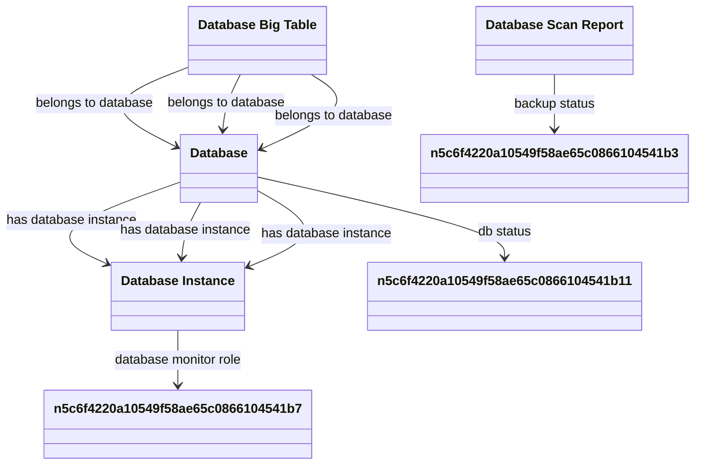

```mermaid
	classDiagram

    
    class `Database` {
    
    }

    class `Database Instance` {
    
    }

    class `Database Scan Report` {
    
    }

    class `Database Big Table` {
    
    }

    class `n5c6f4220a10549f58ae65c0866104541b3` {
    
    }

    class `n5c6f4220a10549f58ae65c0866104541b7` {
    
    }

    class `n5c6f4220a10549f58ae65c0866104541b11` {
    
    }


`Database`  --> `n5c6f4220a10549f58ae65c0866104541b11`   :db status  

`Database`  --> `Database Instance`   :has database instance  

`Database Big Table`  --> `Database`   :belongs to database  

`Database Scan Report`  --> `n5c6f4220a10549f58ae65c0866104541b3`   :backup status  

`Database Instance`  --> `n5c6f4220a10549f58ae65c0866104541b7`   :database monitor role  

`Database`  --> `Database Instance`   :has database instance  

`Database`  --> `Database Instance`   :has database instance  

`Database Big Table`  --> `Database`   :belongs to database  

`Database Big Table`  --> `Database`   :belongs to database  

```