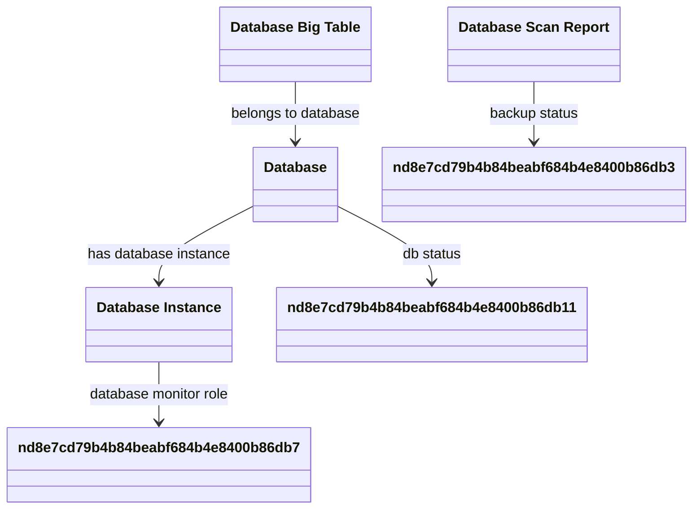

```mermaid
	classDiagram

    
    class `Database` {
    
    }

    class `Database Instance` {
    
    }

    class `Database Scan Report` {
    
    }

    class `Database Big Table` {
    
    }

    class `nd8e7cd79b4b84beabf684b4e8400b86db3` {
    
    }

    class `nd8e7cd79b4b84beabf684b4e8400b86db7` {
    
    }

    class `nd8e7cd79b4b84beabf684b4e8400b86db11` {
    
    }


`Database`  --> `nd8e7cd79b4b84beabf684b4e8400b86db11`   :db status  

`Database Big Table`  --> `Database`   :belongs to database  

`Database`  --> `Database Instance`   :has database instance  

`Database Scan Report`  --> `nd8e7cd79b4b84beabf684b4e8400b86db3`   :backup status  

`Database Instance`  --> `nd8e7cd79b4b84beabf684b4e8400b86db7`   :database monitor role  

```