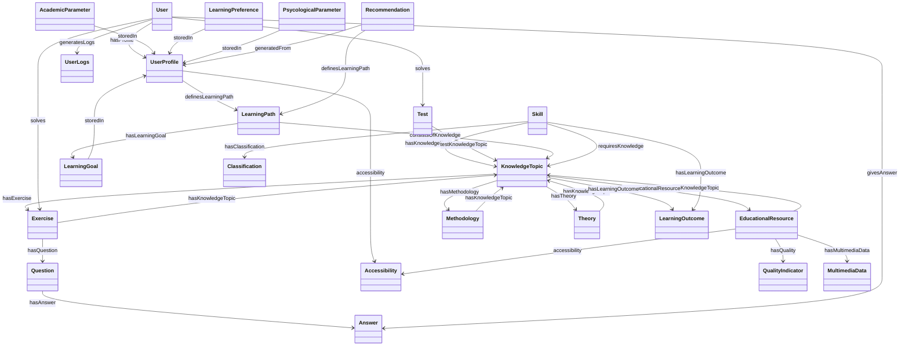

```mermaid
	classDiagram

    
    class KnowledgeTopic {
    
    }

    class EducationalResource {
    
    }

    class UserProfile {
    
    }

    class User {
    
    }

    class Skill {
    
    }

    class Exercise {
    
    }

    class LearningPath {
    
    }

    class Recommendation {
    
    }

    class Question {
    
    }

    class Methodology {
    
    }


UserProfile  --> LearningPath   :definesLearningPath  

Exercise  --> Question   :hasQuestion  

LearningPath  --> LearningGoal   :hasLearningGoal  

KnowledgeTopic  --> Exercise   :hasExercise  

Question  --> Answer   :hasAnswer  

Skill  --> KnowledgeTopic   :hasKnowledgeTopic  

Theory  --> KnowledgeTopic   :hasKnowledgeTopic  

KnowledgeTopic  --> Theory   :hasTheory  

User  --> UserProfile   :hasProfile  

User  --> Test   :solves  

UserProfile  --> Accessibility   :accessibility  

User  --> Answer   :givesAnswer  

User  --> Exercise   :solves  

EducationalResource  --> QualityIndicator   :hasQuality  

AcademicParameter  --> UserProfile   :storedIn  

User  --> UserLogs   :generatesLogs  

EducationalResource  --> MultimediaData   :hasMultimediaData  

Recommendation  --> LearningPath   :definesLearningPath  

LearningPreference  --> UserProfile   :storedIn  

EducationalResource  --> KnowledgeTopic   :hasKnowledgeTopic  

Test  --> KnowledgeTopic   :testKnowledgeTopic  

Methodology  --> KnowledgeTopic   :hasKnowledgeTopic  

KnowledgeTopic  --> EducationalResource   :hasEducationalResource  

KnowledgeTopic  --> LearningOutcome   :hasLearningOutcome  

Skill  --> LearningOutcome   :hasLearningOutcome  

LearningPath  --> KnowledgeTopic   :consistsOfKnowledge  

Skill  --> Classification   :hasClassification  

PsycologicalParameter  --> UserProfile   :storedIn  

LearningGoal  --> UserProfile   :storedIn  

KnowledgeTopic  --> Methodology   :hasMethodology  

Exercise  --> KnowledgeTopic   :hasKnowledgeTopic  

EducationalResource  --> Accessibility   :accessibility  

Recommendation  --> UserProfile   :generatedFrom  

Skill  --> KnowledgeTopic   :requiresKnowledge  

```