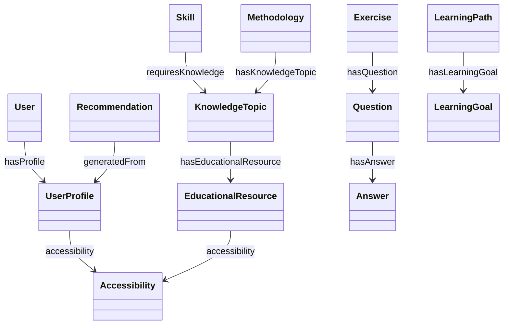

```mermaid
	classDiagram

    
    class KnowledgeTopic {
    
    }

    class EducationalResource {
    
    }

    class UserProfile {
    
    }

    class User {
    
    }

    class Skill {
    
    }

    class Exercise {
    
    }

    class LearningPath {
    
    }

    class Recommendation {
    
    }

    class Question {
    
    }

    class Methodology {
    
    }


Skill  --> KnowledgeTopic   :requiresKnowledge  

KnowledgeTopic  --> EducationalResource   :hasEducationalResource  

User  --> UserProfile   :hasProfile  

UserProfile  --> Accessibility   :accessibility  

EducationalResource  --> Accessibility   :accessibility  

Exercise  --> Question   :hasQuestion  

Recommendation  --> UserProfile   :generatedFrom  

LearningPath  --> LearningGoal   :hasLearningGoal  

Methodology  --> KnowledgeTopic   :hasKnowledgeTopic  

Question  --> Answer   :hasAnswer  

```