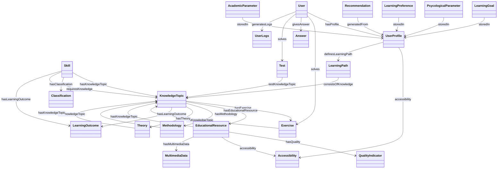

```mermaid
	classDiagram

    
    class KnowledgeTopic {
    
    }

    class EducationalResource {
    
    }

    class UserProfile {
    
    }

    class User {
    
    }

    class Skill {
    
    }


LearningGoal  --> UserProfile   :storedIn  

Methodology  --> KnowledgeTopic   :hasKnowledgeTopic  

PsycologicalParameter  --> UserProfile   :storedIn  

User  --> UserProfile   :hasProfile  

KnowledgeTopic  --> Exercise   :hasExercise  

KnowledgeTopic  --> EducationalResource   :hasEducationalResource  

Skill  --> KnowledgeTopic   :hasKnowledgeTopic  

Exercise  --> KnowledgeTopic   :hasKnowledgeTopic  

Theory  --> KnowledgeTopic   :hasKnowledgeTopic  

KnowledgeTopic  --> Methodology   :hasMethodology  

KnowledgeTopic  --> Theory   :hasTheory  

LearningPreference  --> UserProfile   :storedIn  

Recommendation  --> UserProfile   :generatedFrom  

EducationalResource  --> QualityIndicator   :hasQuality  

Skill  --> Classification   :hasClassification  

UserProfile  --> Accessibility   :accessibility  

UserProfile  --> LearningPath   :definesLearningPath  

KnowledgeTopic  --> LearningOutcome   :hasLearningOutcome  

EducationalResource  --> Accessibility   :accessibility  

AcademicParameter  --> UserProfile   :storedIn  

EducationalResource  --> MultimediaData   :hasMultimediaData  

User  --> Exercise   :solves  

Test  --> KnowledgeTopic   :testKnowledgeTopic  

Skill  --> KnowledgeTopic   :requiresKnowledge  

User  --> Answer   :givesAnswer  

Skill  --> LearningOutcome   :hasLearningOutcome  

LearningPath  --> KnowledgeTopic   :consistsOfKnowledge  

User  --> Test   :solves  

User  --> UserLogs   :generatesLogs  

EducationalResource  --> KnowledgeTopic   :hasKnowledgeTopic  

```