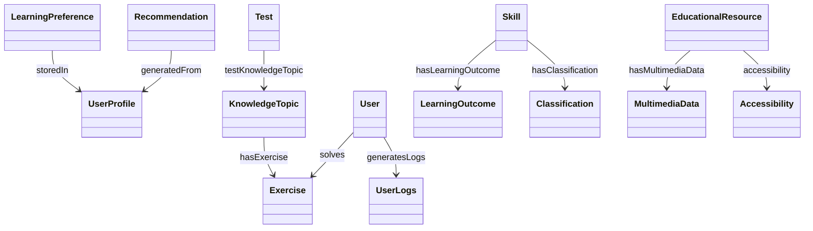

```mermaid
	classDiagram

    
    class KnowledgeTopic {
    
    }

    class EducationalResource {
    
    }

    class UserProfile {
    
    }

    class User {
    
    }

    class Skill {
    
    }


User  --> UserLogs   :generatesLogs  

EducationalResource  --> Accessibility   :accessibility  

Recommendation  --> UserProfile   :generatedFrom  

User  --> Exercise   :solves  

KnowledgeTopic  --> Exercise   :hasExercise  

Test  --> KnowledgeTopic   :testKnowledgeTopic  

LearningPreference  --> UserProfile   :storedIn  

Skill  --> Classification   :hasClassification  

Skill  --> LearningOutcome   :hasLearningOutcome  

EducationalResource  --> MultimediaData   :hasMultimediaData  

```