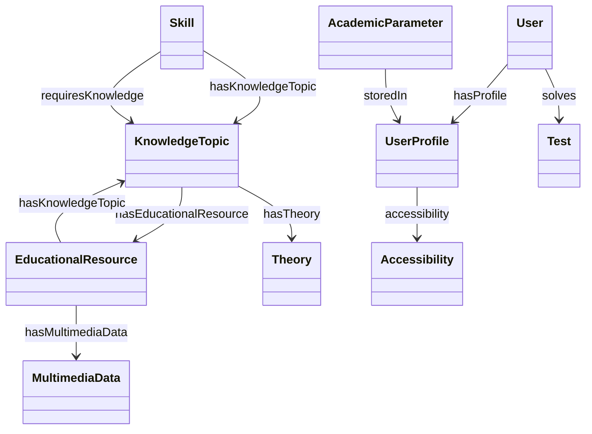

```mermaid
	classDiagram

    
    class KnowledgeTopic {
    
    }

    class EducationalResource {
    
    }

    class UserProfile {
    
    }

    class User {
    
    }

    class Skill {
    
    }


KnowledgeTopic  --> EducationalResource   :hasEducationalResource  

EducationalResource  --> KnowledgeTopic   :hasKnowledgeTopic  

Skill  --> KnowledgeTopic   :hasKnowledgeTopic  

User  --> UserProfile   :hasProfile  

Skill  --> KnowledgeTopic   :requiresKnowledge  

KnowledgeTopic  --> Theory   :hasTheory  

AcademicParameter  --> UserProfile   :storedIn  

EducationalResource  --> MultimediaData   :hasMultimediaData  

User  --> Test   :solves  

UserProfile  --> Accessibility   :accessibility  

```