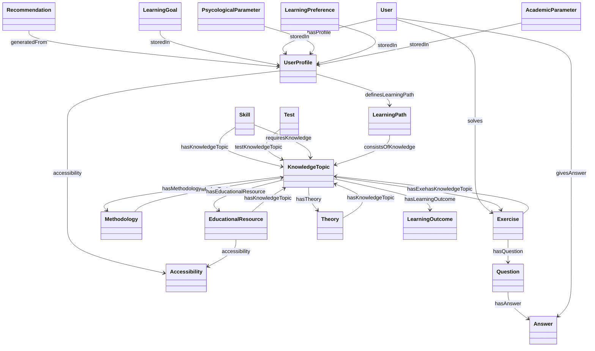

```mermaid
	classDiagram

    
    class KnowledgeTopic {
    
    }

    class UserProfile {
    
    }

    class Answer {
    
    }

    class Exercise {
    
    }

    class Accessibility {
    
    }


UserProfile  --> Accessibility   :accessibility  

Methodology  --> KnowledgeTopic   :hasKnowledgeTopic  

Question  --> Answer   :hasAnswer  

Recommendation  --> UserProfile   :generatedFrom  

LearningGoal  --> UserProfile   :storedIn  

UserProfile  --> LearningPath   :definesLearningPath  

EducationalResource  --> Accessibility   :accessibility  

Skill  --> KnowledgeTopic   :hasKnowledgeTopic  

User  --> Exercise   :solves  

Theory  --> KnowledgeTopic   :hasKnowledgeTopic  

User  --> UserProfile   :hasProfile  

User  --> Answer   :givesAnswer  

PsycologicalParameter  --> UserProfile   :storedIn  

KnowledgeTopic  --> Exercise   :hasExercise  

KnowledgeTopic  --> Theory   :hasTheory  

KnowledgeTopic  --> EducationalResource   :hasEducationalResource  

Exercise  --> KnowledgeTopic   :hasKnowledgeTopic  

Test  --> KnowledgeTopic   :testKnowledgeTopic  

KnowledgeTopic  --> LearningOutcome   :hasLearningOutcome  

EducationalResource  --> KnowledgeTopic   :hasKnowledgeTopic  

Exercise  --> Question   :hasQuestion  

Skill  --> KnowledgeTopic   :requiresKnowledge  

KnowledgeTopic  --> Methodology   :hasMethodology  

LearningPreference  --> UserProfile   :storedIn  

LearningPath  --> KnowledgeTopic   :consistsOfKnowledge  

AcademicParameter  --> UserProfile   :storedIn  

```