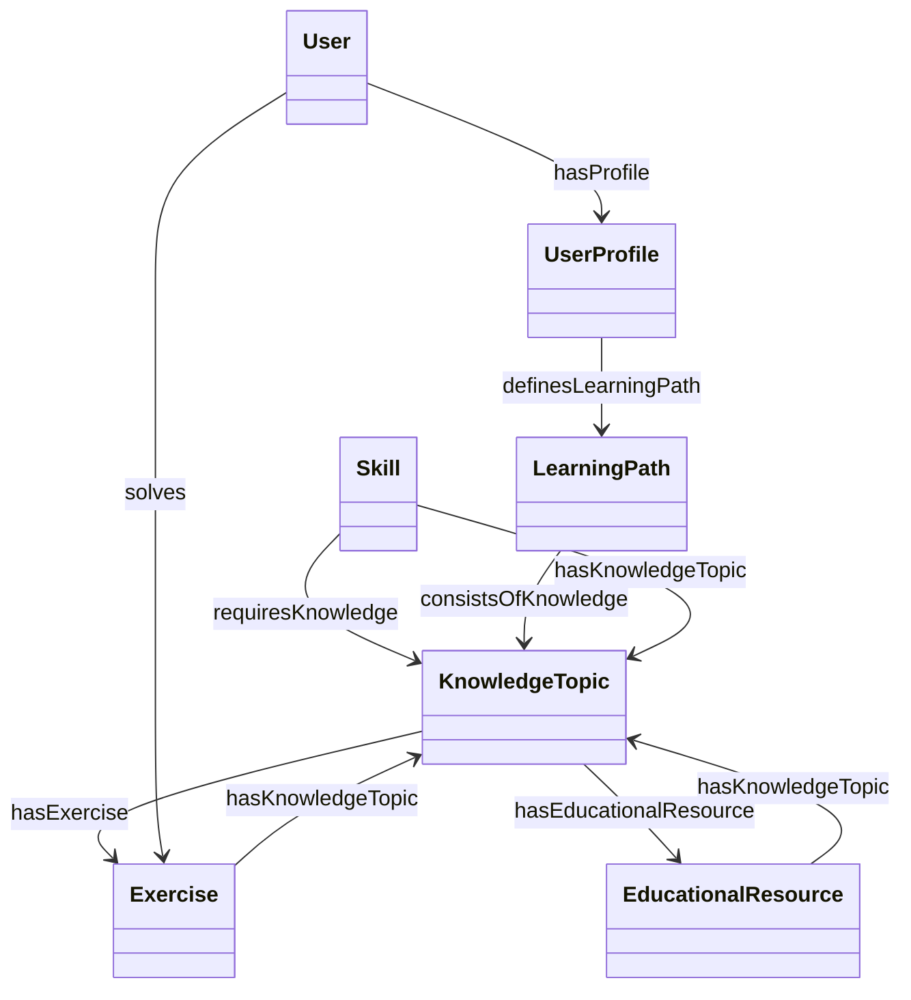

```mermaid
	classDiagram

    
    class `KnowledgeTopic` {
    
    }

    class `EducationalResource` {
    
    }

    class `UserProfile` {
    
    }

    class `User` {
    
    }

    class `Skill` {
    
    }

    class `Exercise` {
    
    }

    class `LearningPath` {
    
    }


`EducationalResource`  --> `KnowledgeTopic`   :hasKnowledgeTopic  

`Skill`  --> `KnowledgeTopic`   :requiresKnowledge  

`LearningPath`  --> `KnowledgeTopic`   :consistsOfKnowledge  

`KnowledgeTopic`  --> `Exercise`   :hasExercise  

`UserProfile`  --> `LearningPath`   :definesLearningPath  

`User`  --> `UserProfile`   :hasProfile  

`Skill`  --> `KnowledgeTopic`   :hasKnowledgeTopic  

`Exercise`  --> `KnowledgeTopic`   :hasKnowledgeTopic  

`KnowledgeTopic`  --> `EducationalResource`   :hasEducationalResource  

`User`  --> `Exercise`   :solves  

```