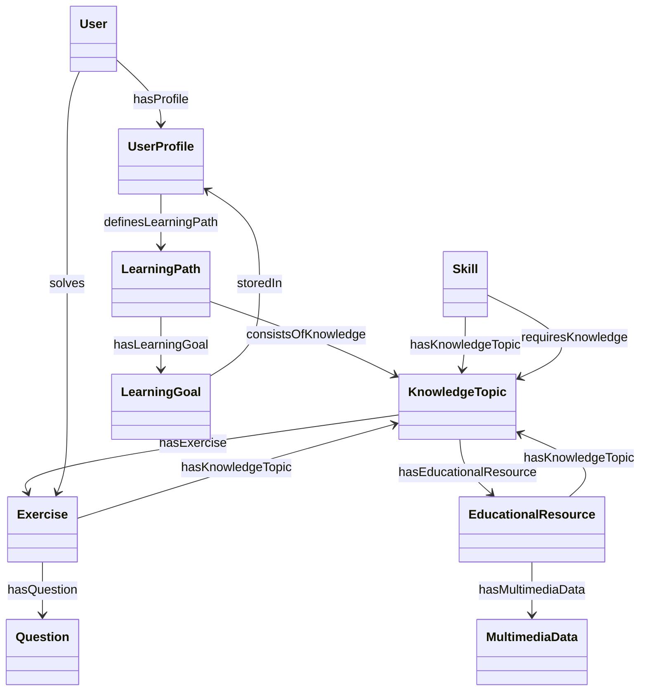

```mermaid
	classDiagram

    
    class KnowledgeTopic {
    
    }

    class EducationalResource {
    
    }

    class UserProfile {
    
    }

    class User {
    
    }

    class Skill {
    
    }

    class Exercise {
    
    }

    class LearningPath {
    
    }


LearningPath  --> KnowledgeTopic   :consistsOfKnowledge  

Skill  --> KnowledgeTopic   :hasKnowledgeTopic  

UserProfile  --> LearningPath   :definesLearningPath  

KnowledgeTopic  --> Exercise   :hasExercise  

KnowledgeTopic  --> EducationalResource   :hasEducationalResource  

User  --> Exercise   :solves  

Exercise  --> KnowledgeTopic   :hasKnowledgeTopic  

Skill  --> KnowledgeTopic   :requiresKnowledge  

EducationalResource  --> KnowledgeTopic   :hasKnowledgeTopic  

User  --> UserProfile   :hasProfile  

LearningGoal  --> UserProfile   :storedIn  

EducationalResource  --> MultimediaData   :hasMultimediaData  

LearningPath  --> LearningGoal   :hasLearningGoal  

Exercise  --> Question   :hasQuestion  

```