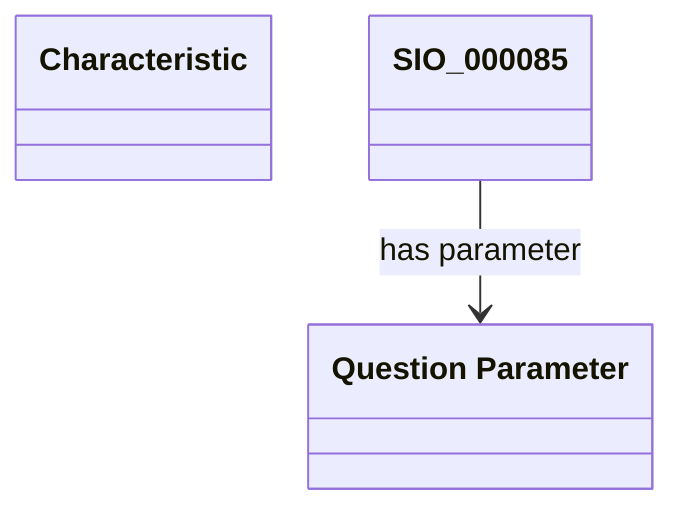

```mermaid
	classDiagram

    
    class `Question Parameter` {
    
    }

    class `Characteristic` {
    
    }

    class `SIO_000085` {
    
    }


`SIO_000085`  --> `Question Parameter`   :has parameter  

```