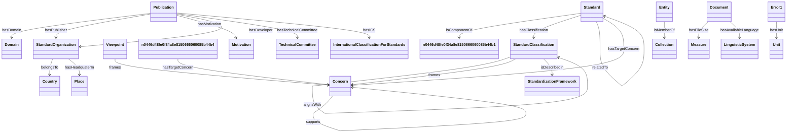

```mermaid
	classDiagram

    
    class StandardClassification {
    
    }

    class Publication {
    
    }

    class Concern {
    
    }

    class Standard {
    
    }

    class StandardOrganization {
    
    }

    class Document {
    
    }

    class Error1 {
    
    }

    class Entity {
    
    }

    class Viewpoint {
    
    }

    class n0446d48fe0f34a8e8150666060085b44b4 {
    
    }


Publication  --> Domain   :hasDomain  

Standard  --> n0446d48fe0f34a8e8150666060085b44b1   :isComponentOf  

Viewpoint  --> Concern   :frames  

Publication  --> StandardOrganization   :hasPublisher  

n0446d48fe0f34a8e8150666060085b44b4  --> Concern   :hasTargetConcern  

Publication  --> Motivation   :hasMotivation  

StandardClassification  --> StandardClassification   :alignesWith  

Standard  --> StandardClassification   :hasClassification  

Entity  --> Collection   :isMemberOf  

StandardClassification  --> Concern   :frames  

Concern  --> Concern   :supports  

Standard  --> Standard   :relatedTo  

StandardOrganization  --> Country   :belongsTo  

Publication  --> StandardOrganization   :hasDeveloper  

Standard  --> Concern   :hasTargetConcern  

Document  --> Measure   :hasFileSize  

Publication  --> TechnicalCommittee   :hasTechnicalCommittee  

StandardClassification  --> StandardizationFramework   :isDescribedin  

Publication  --> InternationalClassificationForStandards   :hasICS  

StandardClassification  --> StandardClassification   :alignsWith  

Document  --> LinguisticSystem   :hasAvailableLanguage  

StandardOrganization  --> Place   :hasHeadquaterIn  

Error1  --> Unit   :hasUnit  

```