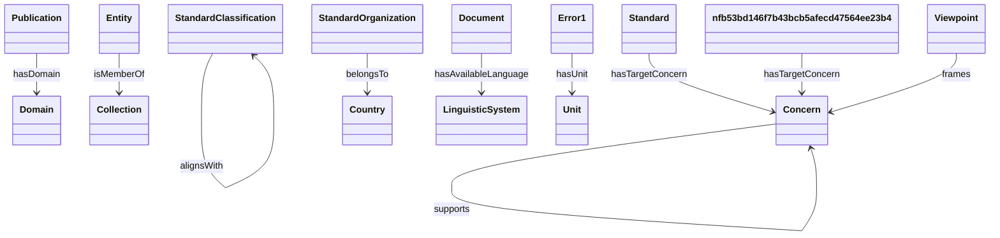

```mermaid
	classDiagram

    
    class StandardClassification {
    
    }

    class Publication {
    
    }

    class Concern {
    
    }

    class Standard {
    
    }

    class StandardOrganization {
    
    }

    class Document {
    
    }

    class Error1 {
    
    }

    class Entity {
    
    }

    class Viewpoint {
    
    }

    class nfb53bd146f7b43bcb5afecd47564ee23b4 {
    
    }


Publication  --> Domain   :hasDomain  

Standard  --> Concern   :hasTargetConcern  

Entity  --> Collection   :isMemberOf  

StandardOrganization  --> Country   :belongsTo  

nfb53bd146f7b43bcb5afecd47564ee23b4  --> Concern   :hasTargetConcern  

Document  --> LinguisticSystem   :hasAvailableLanguage  

StandardClassification  --> StandardClassification   :alignsWith  

Viewpoint  --> Concern   :frames  

Concern  --> Concern   :supports  

Error1  --> Unit   :hasUnit  

```