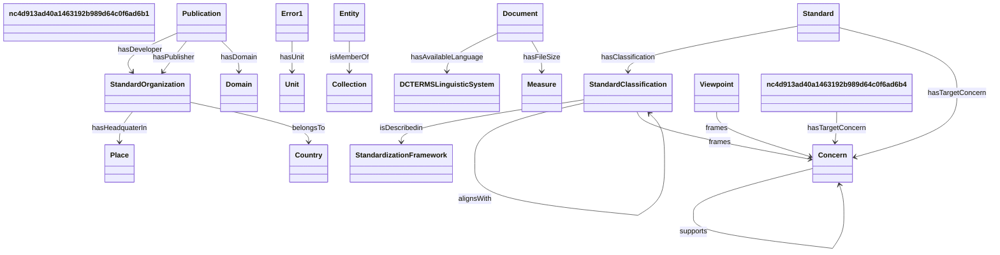

```mermaid
	classDiagram

    
    class Concern {
    
    }

    class StandardClassification {
    
    }

    class StandardOrganization {
    
    }

    class Unit {
    
    }

    class nc4d913ad40a1463192b989d64c0f6ad6b1 {
    
    }

    class Collection {
    
    }

    class Country {
    
    }

    class DCTERMSLinguisticSystem {
    
    }

    class Domain {
    
    }

    class Measure {
    
    }


StandardOrganization  --> Place   :hasHeadquaterIn  

Publication  --> StandardOrganization   :hasDeveloper  

Concern  --> Concern   :supports  

StandardClassification  --> StandardizationFramework   :isDescribedin  

Document  --> DCTERMSLinguisticSystem   :hasAvailableLanguage  

StandardClassification  --> StandardClassification   :alignesWith  

Error1  --> Unit   :hasUnit  

Standard  --> StandardClassification   :hasClassification  

Entity  --> Collection   :isMemberOf  

Viewpoint  --> Concern   :frames  

Standard  --> Concern   :hasTargetConcern  

StandardOrganization  --> Country   :belongsTo  

Publication  --> StandardOrganization   :hasPublisher  

StandardClassification  --> Concern   :frames  

Publication  --> Domain   :hasDomain  

StandardClassification  --> StandardClassification   :alignsWith  

nc4d913ad40a1463192b989d64c0f6ad6b4  --> Concern   :hasTargetConcern  

Document  --> Measure   :hasFileSize  

```