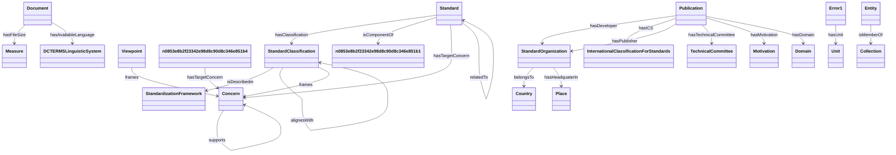

```mermaid
	classDiagram

    
    class StandardClassification {
    
    }

    class Publication {
    
    }

    class Concern {
    
    }

    class Standard {
    
    }

    class StandardOrganization {
    
    }

    class Document {
    
    }

    class Error1 {
    
    }

    class Entity {
    
    }

    class Viewpoint {
    
    }

    class n0853e8b2f23342e98d8c90d8c346e851b4 {
    
    }


StandardClassification  --> StandardizationFramework   :isDescribedin  

Publication  --> StandardOrganization   :hasDeveloper  

StandardClassification  --> StandardClassification   :alignsWith  

StandardOrganization  --> Country   :belongsTo  

Document  --> Measure   :hasFileSize  

Publication  --> InternationalClassificationForStandards   :hasICS  

Publication  --> StandardOrganization   :hasPublisher  

Document  --> DCTERMSLinguisticSystem   :hasAvailableLanguage  

Standard  --> StandardClassification   :hasClassification  

Standard  --> n0853e8b2f23342e98d8c90d8c346e851b1   :isComponentOf  

Standard  --> Concern   :hasTargetConcern  

StandardOrganization  --> Place   :hasHeadquaterIn  

Publication  --> TechnicalCommittee   :hasTechnicalCommittee  

Publication  --> Motivation   :hasMotivation  

Error1  --> Unit   :hasUnit  

n0853e8b2f23342e98d8c90d8c346e851b4  --> Concern   :hasTargetConcern  

Entity  --> Collection   :isMemberOf  

Viewpoint  --> Concern   :frames  

Standard  --> Standard   :relatedTo  

StandardClassification  --> Concern   :frames  

Publication  --> Domain   :hasDomain  

Concern  --> Concern   :supports  

StandardClassification  --> StandardClassification   :alignesWith  

```