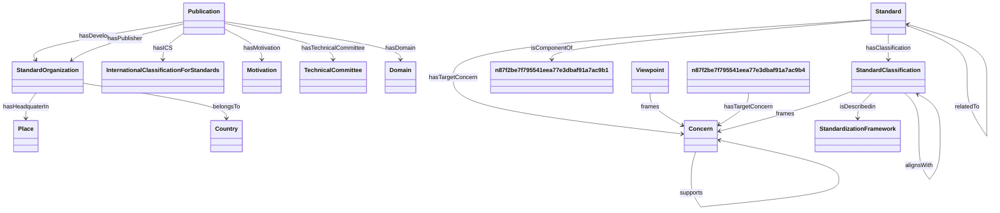

```mermaid
	classDiagram

    
    class StandardClassification {
    
    }

    class Publication {
    
    }

    class Concern {
    
    }

    class Standard {
    
    }

    class StandardOrganization {
    
    }


Concern  --> Concern   :supports  

Standard  --> Concern   :hasTargetConcern  

Standard  --> n87f2be7f795541eea77e3dbaf91a7ac9b1   :isComponentOf  

Publication  --> StandardOrganization   :hasDeveloper  

Publication  --> StandardOrganization   :hasPublisher  

Publication  --> InternationalClassificationForStandards   :hasICS  

StandardOrganization  --> Place   :hasHeadquaterIn  

StandardClassification  --> Concern   :frames  

StandardClassification  --> StandardizationFramework   :isDescribedin  

Standard  --> StandardClassification   :hasClassification  

StandardClassification  --> StandardClassification   :alignesWith  

Publication  --> Motivation   :hasMotivation  

Publication  --> TechnicalCommittee   :hasTechnicalCommittee  

StandardClassification  --> StandardClassification   :alignsWith  

Publication  --> Domain   :hasDomain  

Viewpoint  --> Concern   :frames  

Standard  --> Standard   :relatedTo  

StandardOrganization  --> Country   :belongsTo  

n87f2be7f795541eea77e3dbaf91a7ac9b4  --> Concern   :hasTargetConcern  

```