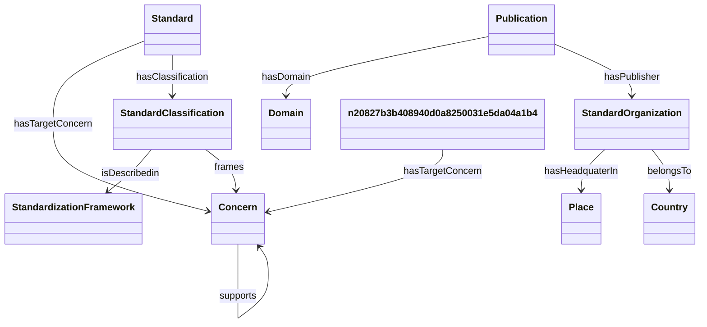

```mermaid
	classDiagram

    
    class StandardClassification {
    
    }

    class Publication {
    
    }

    class Concern {
    
    }

    class Standard {
    
    }

    class StandardOrganization {
    
    }


Publication  --> Domain   :hasDomain  

StandardOrganization  --> Place   :hasHeadquaterIn  

Standard  --> Concern   :hasTargetConcern  

Standard  --> StandardClassification   :hasClassification  

Concern  --> Concern   :supports  

StandardClassification  --> StandardizationFramework   :isDescribedin  

StandardClassification  --> Concern   :frames  

Publication  --> StandardOrganization   :hasPublisher  

n20827b3b408940d0a8250031e5da04a1b4  --> Concern   :hasTargetConcern  

StandardOrganization  --> Country   :belongsTo  

```