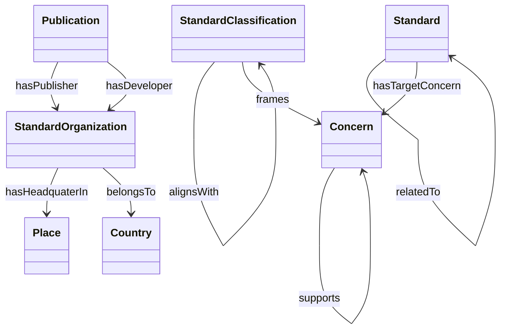

```mermaid
	classDiagram

    
    class StandardClassification {
    
    }

    class Publication {
    
    }

    class Concern {
    
    }

    class Standard {
    
    }

    class StandardOrganization {
    
    }


StandardClassification  --> StandardClassification   :alignesWith  

Standard  --> Standard   :relatedTo  

Concern  --> Concern   :supports  

Publication  --> StandardOrganization   :hasPublisher  

Standard  --> Concern   :hasTargetConcern  

StandardClassification  --> StandardClassification   :alignsWith  

StandardClassification  --> Concern   :frames  

Publication  --> StandardOrganization   :hasDeveloper  

StandardOrganization  --> Place   :hasHeadquaterIn  

StandardOrganization  --> Country   :belongsTo  

```