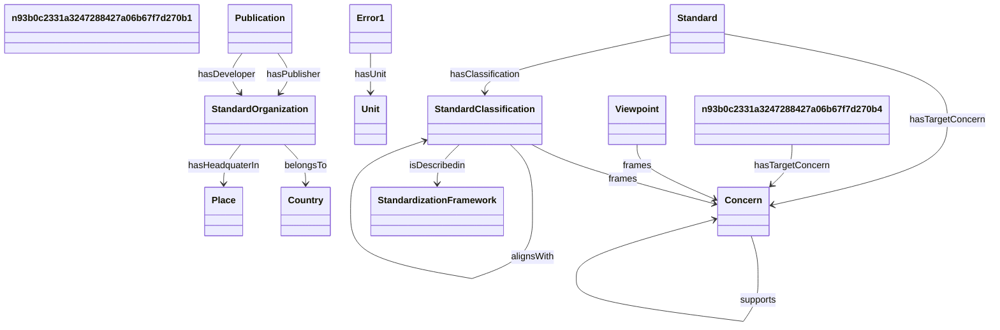

```mermaid
	classDiagram

    
    class Concern {
    
    }

    class StandardClassification {
    
    }

    class StandardOrganization {
    
    }

    class Unit {
    
    }

    class n93b0c2331a3247288427a06b67f7d270b1 {
    
    }


StandardClassification  --> Concern   :frames  

Concern  --> Concern   :supports  

Standard  --> Concern   :hasTargetConcern  

StandardClassification  --> StandardClassification   :alignesWith  

StandardOrganization  --> Country   :belongsTo  

StandardOrganization  --> Place   :hasHeadquaterIn  

Error1  --> Unit   :hasUnit  

StandardClassification  --> StandardClassification   :alignsWith  

Standard  --> StandardClassification   :hasClassification  

Publication  --> StandardOrganization   :hasPublisher  

Viewpoint  --> Concern   :frames  

StandardClassification  --> StandardizationFramework   :isDescribedin  

n93b0c2331a3247288427a06b67f7d270b4  --> Concern   :hasTargetConcern  

Publication  --> StandardOrganization   :hasDeveloper  

```