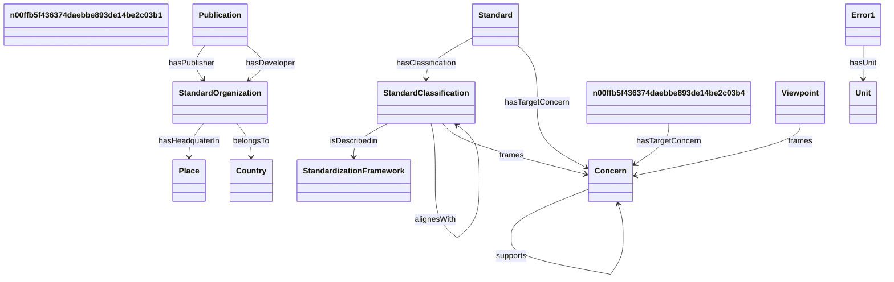

```mermaid
	classDiagram

    
    class Concern {
    
    }

    class StandardClassification {
    
    }

    class StandardOrganization {
    
    }

    class Unit {
    
    }

    class n00ffb5f436374daebbe893de14be2c03b1 {
    
    }


n00ffb5f436374daebbe893de14be2c03b4  --> Concern   :hasTargetConcern  

StandardClassification  --> StandardizationFramework   :isDescribedin  

Viewpoint  --> Concern   :frames  

StandardClassification  --> StandardClassification   :alignsWith  

StandardOrganization  --> Place   :hasHeadquaterIn  

Standard  --> StandardClassification   :hasClassification  

Publication  --> StandardOrganization   :hasPublisher  

Error1  --> Unit   :hasUnit  

Standard  --> Concern   :hasTargetConcern  

StandardClassification  --> Concern   :frames  

Publication  --> StandardOrganization   :hasDeveloper  

StandardOrganization  --> Country   :belongsTo  

StandardClassification  --> StandardClassification   :alignesWith  

Concern  --> Concern   :supports  

```