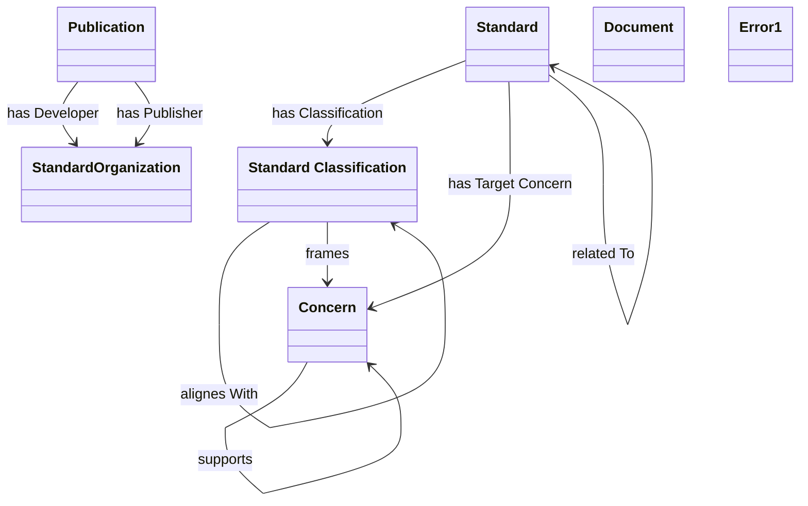

```mermaid
	classDiagram

    
    class `Standard Classification` {
    
    }

    class `Publication` {
    
    }

    class `Concern` {
    
    }

    class `Standard` {
    
    }

    class `StandardOrganization` {
    
    }

    class `Document` {
    
    }

    class `Error1` {
    
    }


`Publication`  --> `StandardOrganization`   :has Developer  

`Standard Classification`  --> `Standard Classification`   :alignes With  

`Standard`  --> `Standard Classification`   :has Classification  

`Concern`  --> `Concern`   :supports  

`Standard`  --> `Concern`   :has Target Concern  

`Standard`  --> `Standard`   :related To  

`Standard Classification`  --> `Concern`   :frames  

`Publication`  --> `StandardOrganization`   :has Publisher  

`Standard Classification`  --> `Standard Classification`   :alignes With  

```