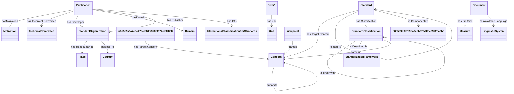

```mermaid
	classDiagram

    
    class Standard Classification {
    
    }

    class Publication {
    
    }

    class Concern {
    
    }

    class Standard {
    
    }

    class StandardOrganization {
    
    }

    class Document {
    
    }

    class Error1 {
    
    }


Standard  --> Concern   :has Target Concern  

Publication  --> Motivation   :hasMotivation  

n8d5e9b9a7e9c47ecb972a3f8e9972ca9b868  --> Concern   :has Target Concern  

Concern  --> Concern   :supports  

Standard Classification  --> Standard Classification   :alignes With  

Standard Classification  --> Standard Classification   :alignes With  

Standard  --> Standard   :related To  

Standard Classification  --> Standarization Framework   :is Described in  

Standard  --> Standard Classification   :has Classification  

Publication  --> TechnicalCommittee   :has Technical Committee  

Publication  --> StandardOrganization   :has Developer  

Error1  --> Unit   :has unit  

Publication  --> Domain   :hasDomain  

Viewpoint  --> Concern   :frames  

StandardOrganization  --> Place   :has Headquater In  

Document  --> Measure   :has File Size  

Publication  --> StandardOrganization   :has Publisher  

StandardOrganization  --> Country   :belongs To  

Standard Classification  --> Concern   :frames  

Standard  --> n8d5e9b9a7e9c47ecb972a3f8e9972ca9b9   :is Component Of  

Publication  --> InternationalClassificationForStandards   :has ICS  

Document  --> LinguisticSystem   :has Available Language  

```