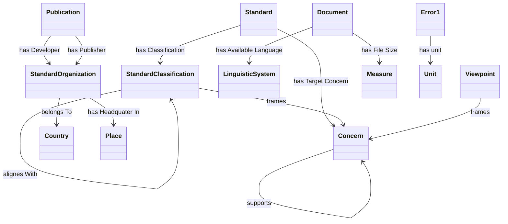

```mermaid
	classDiagram

    
    class Standard Classification {
    
    }

    class Publication {
    
    }

    class Concern {
    
    }

    class Standard {
    
    }

    class StandardOrganization {
    
    }

    class Document {
    
    }

    class Error1 {
    
    }


Standard Classification  --> Standard Classification   :alignes With  

Standard  --> Concern   :has Target Concern  

Standard  --> Standard Classification   :has Classification  

Publication  --> StandardOrganization   :has Developer  

Standard Classification  --> Concern   :frames  

Publication  --> StandardOrganization   :has Publisher  

Concern  --> Concern   :supports  

Document  --> LinguisticSystem   :has Available Language  

Viewpoint  --> Concern   :frames  

Document  --> Measure   :has File Size  

StandardOrganization  --> Country   :belongs To  

StandardOrganization  --> Place   :has Headquater In  

Error1  --> Unit   :has unit  

```