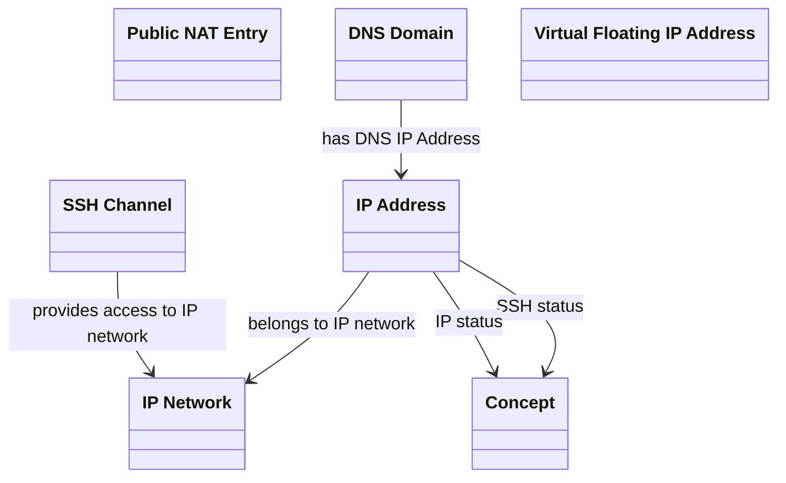

```mermaid
	classDiagram

    
    class `IP Address` {
    
    }

    class `IP Network` {
    
    }

    class `Public NAT Entry` {
    
    }

    class `DNS Domain` {
    
    }

    class `SSH Channel` {
    
    }

    class `Concept` {
    
    }

    class `Virtual Floating IP Address` {
    
    }


`DNS Domain`  --> `IP Address`   :has DNS IP Address  

`IP Address`  --> `IP Network`   :belongs to IP network  

`SSH Channel`  --> `IP Network`   :provides access to IP network  

`IP Address`  --> `Concept`   :SSH status  

`IP Address`  --> `Concept`   :IP status  

```