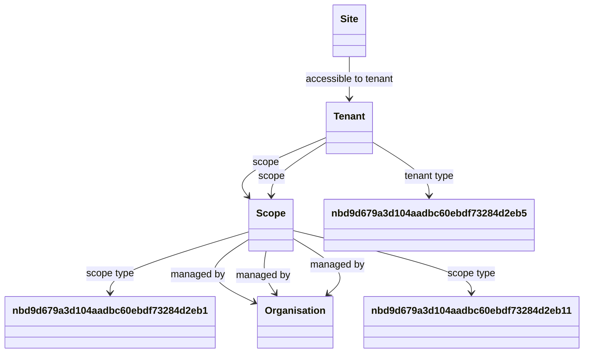

```mermaid
	classDiagram

    
    class `Scope` {
    
    }

    class `Tenant` {
    
    }

    class `Site` {
    
    }

    class `Organisation` {
    
    }

    class `nbd9d679a3d104aadbc60ebdf73284d2eb1` {
    
    }

    class `nbd9d679a3d104aadbc60ebdf73284d2eb5` {
    
    }

    class `nbd9d679a3d104aadbc60ebdf73284d2eb11` {
    
    }


`Site`  --> `Tenant`   :accessible to tenant  

`Scope`  --> `nbd9d679a3d104aadbc60ebdf73284d2eb1`   :scope type  

`Tenant`  --> `nbd9d679a3d104aadbc60ebdf73284d2eb5`   :tenant type  

`Scope`  --> `Organisation`   :managed by  

`Tenant`  --> `Scope`   :scope  

`Tenant`  --> `Scope`   :scope  

`Scope`  --> `nbd9d679a3d104aadbc60ebdf73284d2eb11`   :scope type  

`Scope`  --> `Organisation`   :managed by  

`Scope`  --> `Organisation`   :managed by  

```