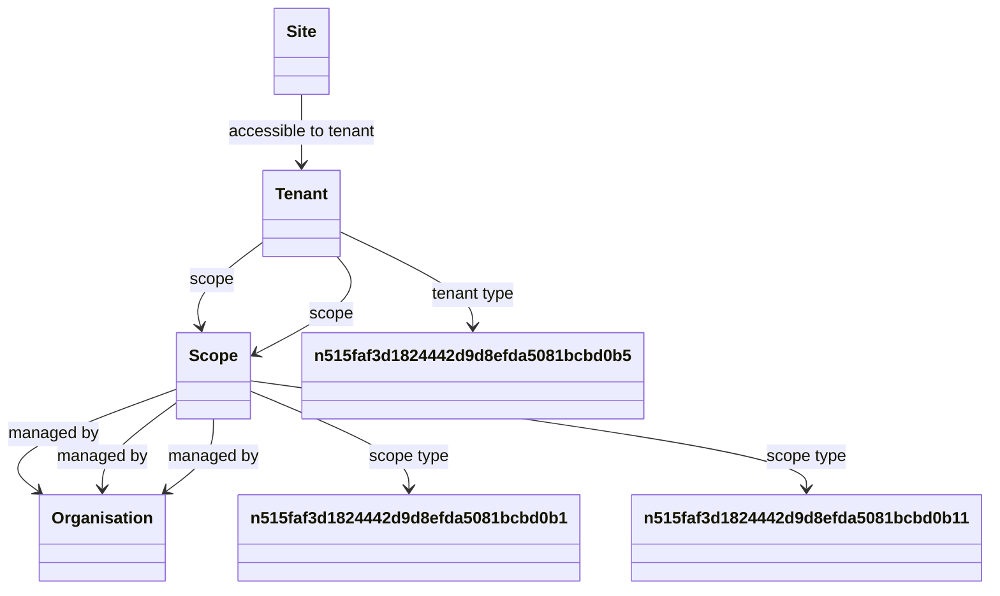

```mermaid
	classDiagram

    
    class `Scope` {
    
    }

    class `Tenant` {
    
    }

    class `Site` {
    
    }

    class `Organisation` {
    
    }

    class `n515faf3d1824442d9d8efda5081bcbd0b1` {
    
    }

    class `n515faf3d1824442d9d8efda5081bcbd0b5` {
    
    }

    class `n515faf3d1824442d9d8efda5081bcbd0b11` {
    
    }


`Tenant`  --> `n515faf3d1824442d9d8efda5081bcbd0b5`   :tenant type  

`Site`  --> `Tenant`   :accessible to tenant  

`Scope`  --> `Organisation`   :managed by  

`Scope`  --> `n515faf3d1824442d9d8efda5081bcbd0b1`   :scope type  

`Tenant`  --> `Scope`   :scope  

`Scope`  --> `Organisation`   :managed by  

`Scope`  --> `Organisation`   :managed by  

`Scope`  --> `n515faf3d1824442d9d8efda5081bcbd0b11`   :scope type  

`Tenant`  --> `Scope`   :scope  

```