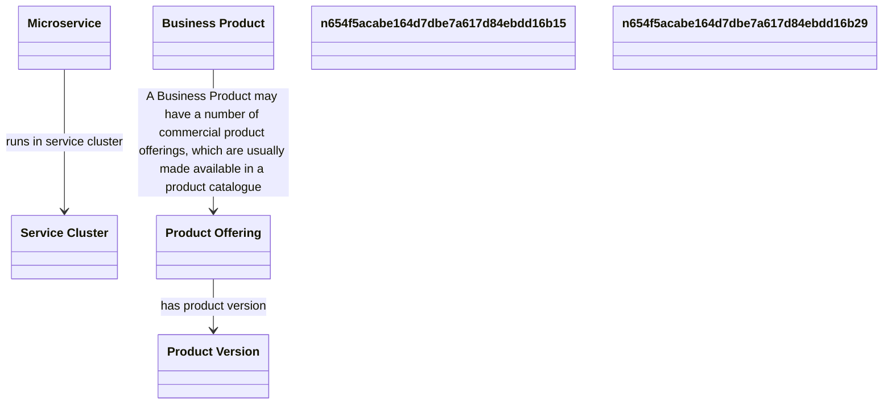

```mermaid
	classDiagram

    
    class `Service Cluster` {
    
    }

    class `Product Offering` {
    
    }

    class `Product Version` {
    
    }

    class `Microservice` {
    
    }

    class `Business Product` {
    
    }

    class `n654f5acabe164d7dbe7a617d84ebdd16b15` {
    
    }

    class `n654f5acabe164d7dbe7a617d84ebdd16b29` {
    
    }


`Business Product`  --> `Product Offering`   :A Business Product may have a number of commercial product offerings, which are usually made available in a product catalogue  

`Microservice`  --> `Service Cluster`   :runs in service cluster  

`Product Offering`  --> `Product Version`   :has product version  

```